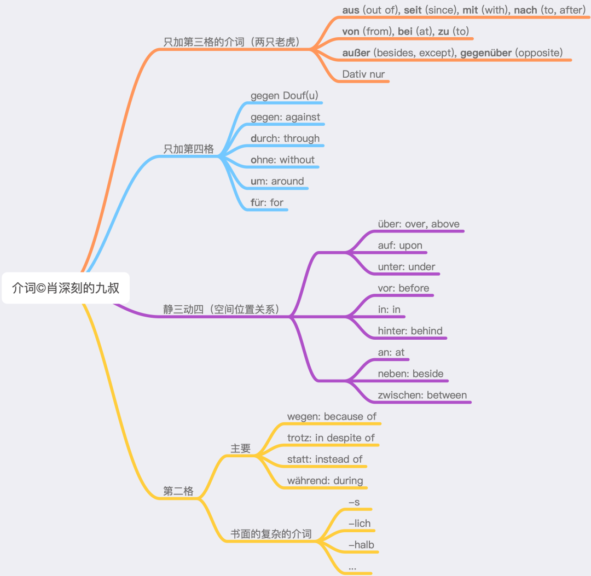

# 前置詞の格支配

第三格を支配する一般的な前置詞（9個）、第四格のみを支配する前置詞（5個）、静三動四の前置詞（9個）、さらに最も一般的な第二格を支配する前置詞（4個）をリストアップすれば、合計27個でドイツ語前置詞の90％以上をカバーできます（数ではなく知識点として）。

### 第三格・第四格支配前置詞

第三格のみを取る9つの前置詞は「2匹のトラ」のメロディで歌えば覚えられます。

第四格のみを取る5つの前置詞は「豆腐にぶつかって死ね」（gegen Douf(u)）で覚えられます。覚えられない場合は豆腐にぶつかる必要があります。Doufの各文字は各前置詞の頭文字を表します。

静三動四の9つの前置詞は主に空間的位置関係に関連し、3つのグループに分けられます。ボールと箱の関係を想像すれば覚えられます。woには第三格、wohinには第四格を使います。また、これらの9つの前置詞は静三動四として使われない場合、構文的用法ではほとんどすべて第四格を取ります。

第二格を支配する前置詞で一般的なのは4つです。その他はほとんどが文語的で使用頻度が低く、徐々に学べます。また語根がわかりやすいので理解しやすいです。

以上が主要なポイントです。他にはわずかな周辺事項のみで、例えばabは一般的に第三格を取ります（実際には冠詞がないことが多く格がわかりません）。entlangは名詞の前では一般に第二格、後では第四格を取ります（名詞の前後に置くことが可能で、名詞後では第四格または第三格、名詞前では第三格を支配し、時折第二格も取ります）。

### 第二格支配前置詞

ドイツ語で第二格を取る前置詞で一般的なのは4つだけです：statt, trotz, wegen, während。対応する英語はそれぞれinstead of, in spite of, because of, duringです。英語のofからもわかるように、これらは第二格（所有格）を取ります。

一般的でない第二格支配前置詞は構成上の特徴から5つの主要なカテゴリーに分類できます：前置詞＋名詞、名詞、形容詞と分詞および副詞、-lichと-s。以下の配列はアルファベット順、語源、構成、類義語と反意語を考慮しています。

1、前置詞＋名詞で構成されるもの：

anhand, anstatt, anstelle, aufgrund, infolge, aufseiten, vonseiten, mithilfe, um ... willen, zugunsten, zuungunsten, zulasten.

この構成方法は英語にも見られ、例えばinsteadがあります。mit Hilfeのように分けて書けるものもあり、なぜ第二格を取るのか理解しやすくなります。

2、他の成分を省略したフレーズや上記のような構成から前置詞が取り除かれ、名詞のみが残ったもの：dank, kraft, zeit, statt, trotz, wegen。例えばanstattがstattに変化しても意味は同じ。dankは「Dank sei ...」に由来する。よく知られている文は「Gott sei Dank」で、Gottは第三格、本来の意味は「神に感謝を捧げます」。

3、前置詞＋名詞は文法的に形容詞や副詞に相当し、分詞も形容詞や副詞として機能するため、形容詞や分詞、副詞も第二格を支配する前置詞に変化することがある：

während, bar, ... halber, -halb (innerhalb, außerhalb, oberhalb, unterhalb), binnen, inmitten, entlang, inklusive, exklusive, minus, plus, ob, unbeschadet, ungeachtet, unweit, unfern, vermöge.

このうちwährendは現在分詞で、動詞währen（続く）に由来し、英語のduringも現在分詞で「続く」から派生。-halbはdie Hälfte（半分）に由来し、後に「側」の意味を持つようになった。inklusiveはラテン語の副詞から、entlangは英語のalongに相当。

4、形容詞と副詞の語尾に-lichが付くもの：

abzüglich, zuzüglich, bezüglich, hinsichtlich, anlässlich, einschließlich, ausschließlich, vorbehaltlich, seitlich, nörd/öst/süd/westlich.

abzüglichとzuzüglichは反意語で、第3部のminusとplusに対応。einschließlichとausschließlichは反意語で、第3部のinklusiveとexklusiveに対応。

5、副詞を構成する方法の一つに-sを付けるもの：

abseits, beiderseits, jenseits, diesseits, seitens, längs, links, rechts, eingangs, anfangs, betreffs, angesichts, mangels, mittels, vermittels(t), namens, zwecks.

Seiteという語根を含むが、第4部のseitlichから第5部のabseits, beiderseits, jenseits, diesseitsまでは空間に関連し、seitensは第1部のaufseitenやvonseitenと同様に参加者を指す。

まとめ：

第二格を支配する前置詞で一般的なのは4つのみ。それ以外は起源と構成により5つに分類可能。第二格前置詞は（前置詞付き）名詞や副詞（ドイツ語では形容詞は副詞として機能し、分詞は形容詞的性質を持つ）に由来する。

補足：

1、vonを第二格の代替形式と見なし、冠詞がない場合に使用可能。

2、第二格前置詞の標準用法は第二格だが、一般的に第三格も可能。代名詞の場合は必ず第三格を使用（例：wegen mir）。