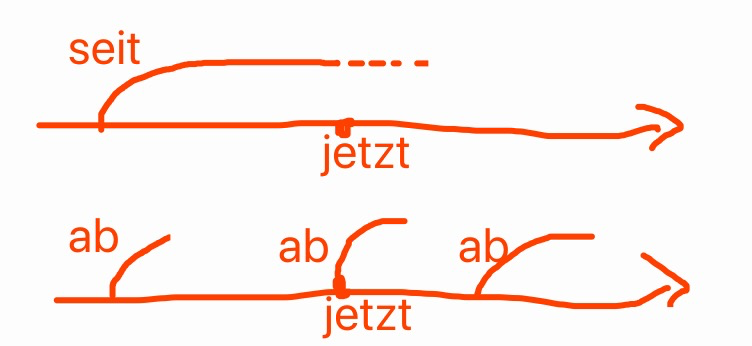

# 前置詞の使い分け

### ab

abの深層的な意味は「離脱」であり、他のすべての意味はここから派生しています。英語のoffとドイツ語のabは同源で、意味もほぼ同じです。英語のofも同源語です：「離脱」は「～から来た、その一部である」という意味を含みます。abは前置詞として原則的に第三格をとり、まれに第四格も可能ですが（自分で使う場合は常に第三格で構いません）、意味は一つだけです：時間と空間の「～から」、例えばab morgen（明日から）。

seitは過去から現在まで、そしておそらく今後も続くことを表し、英語のsinceに相当します。一方、abは起点のみを示し、終点は関係なく、起点が必ずしも過去である必要もありません。英語のfrom ... onに相当します。

abが副詞として使われる場合、「離脱」から2つの意味が派生します：

離れる：ab ins Bett（寝に行く）。ab und zu/an（離れたり来たり→時々）。

離脱して下へ：Hut ab!（帽子を脱ぐ→敬意を表す→感服！）

abは副詞として、分離動詞の動詞が省略されたものと見なすことができます。

ab-が分離接頭辞として使われる場合、6つの小項目に分けられますが、すべて「離脱」の意味に概括できます：

1. 離脱→離れる：abfliegen（飛び立つ）。
2. 離脱→取り除く：einen Ast absägen（枝を切り落とす）。
3. 離脱→表面から取り除く：den Staub abwischen（ほこりを拭き取る）。
4. 離脱→表面の不要なものを取り除く：den Tisch abwischen（テーブルを拭く）。
5. 離脱→表面から幻のように離れる：einen Text abschreiben（文章を書き写す）。
6. 離脱→下へ→止める：das Fahrrad abstellen（自転車を止める）；den Motor abstellen（エンジンを止める）。

### von

vonの語源は不明ですが、ロシア語の前置詞поと同源かもしれません。abは「離脱」を表しますが、後にabの一部の意味がvonに置き換えられ、役割分担が形成されました：abは動的な感じ、vonは静的な感じです。つまり、vonは「起点」を表します、例えばvon hier aus（ここから）。

ドイツ語のvonのほとんどの意味は、英語のfromまたはofで表現できます。これは驚くべきことではありません。なぜなら、vonは元々のabの一部の意味を置き換えたものであり、abとof、off、fromは同じ起源だからです。

「～から」を表すドイツ語には2つの前置詞、ausとvonがあります。多くの学習者がこれらを混同しがちです。明確に区別するための決定的な方法があります。それは語のペアを使うことです。ausとinはペア、von - bei - zuはグループです。したがって、次の文を覚えておけば十分です：「ある場所にいる」場合はinを使い、「～から来た」場合はausを使い、それ以外の場合はvonを使います。例えば：in China（中国に） - aus China（中国から）、(bei Luxun) - von Luxun stammt dieses Zitat（この引用はルーシュンから来ている）。

vonの各意味は「～から」に由来します：

abとvonは通常混同されることはありません。区別が必要な場合は、前置詞としての意味を比較すれば十分です。なぜなら、abと異なり、vonには分離接頭辞の用法がありません。abは時間、順序、空間の「～から」を表し、例えばab morgen（明日から）、ab dem 18. Lebensjahr（18歳から）、ab Frankfurt（フランクフルトから）などです。混同されやすい点は「時間」と「空間」のみです。vonが時間を表す場合は、対になった前置詞構造で使用されます。例えばvon Morgen bis Abend（朝から晩まで）、von Jahr zu Jahr（年々）などです。vonが空間を表す場合は「～から」を意味し、例えばvon Frankfurt（フランクフルトから）、または対になった前置詞構造で使用されます。例えばvon mir aus（私としては構わない）、von Ast zu Ast（枝から枝へ）などです。

先ほどの例にはvon Frankfurtもab Frankfurtもありますが、ab Frankfurtのような表現は交通の略語でのみ使用され、abfahren（出発する）やabfliegen（離陸する）などに関連しています。

vonは「～から」、abは「発、出発」を意味します。「接-化-発」を全て前置詞で表すと、auf - um - abとなります。

以前、abという前置詞の深層的な意味は「離脱」または「離脱して下へ」であると説明しました。離脱であるため、起点があり、この起点はvonによって示されます。そのため、ab-を含む動詞は、起点を表す必要がある場合にvonの前置詞構造と組み合わされます。例えば：

etw. (von etw.) absägen （何かを（何かから）切り落とす）

jn. (von etw.) abberufen （（何かから）誰かを召還する）

(jm.) (von etw.) abraten （（誰かに）（何かを）しないよう勧める）

……

sich (von jm.) verabschieden（（誰かと）別れを告げる）もvonを伴います。

この理解があれば、「依存」を表す2つの単語を区別するのが容易になります：

abhängigは何かにぶら下がっている状態から転じて「依存」を意味するため、用法構造はvon jm./etw. abhängig sein（誰か/何かに依存している）となります。

angewiesenの語根はweisen（指す）であり、weisen/-weisenは主にauf（上から下へ指す）を伴うため、ここでの用法構造はauf jn./etw. angewiesen sein（誰か/何かに依存している）となります。指して、誰か/何かを当てにする、つまり「依存」です。

その他の一般的な前置詞の組み合わせには以下があります：

auf ... auf- 例：auf jn. aufpassen （誰かを世話する）

in ... ein- 例：in etw. eintreten （何かに加入する）

aus ... aus- 例：aus etw. ausziehen （何かから搬出する）

……

つまり、一般的には同じ前置詞を使って構造を形成します。

少し難しいのは：

von ... ab-

および

auf ... zu- 例：auf jn. zugehen （誰かに近づく）

### aus

以下のマインドマップからわかるように、ausの各意味は、前置詞としても接頭辞としても、一つの曖昧なイメージの下で高度に統一することができます。

### über

語源はüberを理解する上で非常に役立ちます。ラテン語のsuperは少し異質に感じられますが、これは複合語であり、sはexの名残です。

überの最初の5つの意味は、実際には高度に曖昧ながらも統一することができます。つまり、静三と動四における「上」と「遠く」です。aufとは異なり、aufは比較的平らな面上にあることを強調します。

第4項の3番目の例文に注意してください。人もまた「通り過ぎる」ことができます。この項目は見落とされがちです。

第5項をよく理解すれば、rüberも理解できるようになります。rüberは同じ平面上での移動です。drübenは同じ平面上の「あそこ」を意味し、英語のover thereに相当します。ここでも語源が役立ちます。

第1-5項のプレースホルダーはwoまたはwohinです。第6項ではこれらの単語は使えず、用法構造の中でüberを明記する必要があります。第6項の3つの小項目には多くの例があり、それらを高度に統一して示すことは、最も誇れる部分の一つです。

英語のaboutのような「～について」の意味ではüberを使います。感情に関する用法構造の前置詞は2つあり、一つはüber、もう一つはaufです。überは既存のものについて、aufは未来のものについて使います。

第7項はあまり重要ではありません。一読しておけば十分で、覚えられなくても問題ありません。

接頭辞über-にはüberの最初の5つの意味があり、ここでは繰り返しません。

注目すべきは、über-で構成される動詞は、分離可能なもの、不可分なもの、そして分離可能でも不可分でもあるものの3種類があることです。über-で構成される動詞は約90個あります。分離可能なものはフレーズのように感じられ、不可分なものは接頭辞によって意味が微調整された単語のように感じられます。

特に注意が必要なのは、食べ飽きる、見飽きる、聞き飽きるの3つの動詞はすべて分離可能です。

### auf

前置詞überは線のような感じですが、aufは面のような感じです。この点を押さえれば、これら2つの前置詞の本質を理解できます。

aufの最も原始的な意味は「下から上へ」、つまり英語のupの意味です。多くの構造や複合語ではupで理解できます。

ギリシャ語のhypoとラテン語のsubが「下」を意味するのは、本来の意味が「下から上へ」であり、まだ上に達していない状態が「下」だからです。subのsは接頭辞exの名残です。

Summeが「総数」を意味するのは、古代では下から上に数えていたからです。ラテン語のsummaは「最上位の数」を意味し、つまり「和、総数」を表します。

1、ドイツ語においてaufは「面」を表し、「比較的平らな面上」が前置詞aufの最も一般的な意味です。これは静三動四の前置詞です。語源的には、まず動四が先に存在し、その後静三が発生したと考えられます。Post（郵便局）、Bank（銀行）、Party（パーティー）などの事物にaufが使われるのは、元来これらのものが平らな面上または屋外にあったためです。

3、aufがPartyなどの事物と結びつくことで、後に「何か（活動）をするために行く」や「何か（過程）をしている」という意味が生まれました。

4.2、überと同様に、aufが表す「面」は必ずしも上方や何かの上に来るだけでなく、外側に押し出す方向も含みます。

4.3、aufsに最上級を伴う用法は文法事項の一つです。最上級を教える際には通常am＋最上級のみが教えられます（より広範に使われるため）。am bestenは述語や状況語として機能しますが、aufs besteは程度を表す状況語で、使用範囲が狭いです。

6.1、verlassen（頼る）がaufを伴うのは、auf jn. bauen（某人を信頼する）の影響です。warten（待つ）がaufを伴うのは、wartenが元来「見張る」という意味だったためです。「望夫石」の故事のように、見張る行為には待つ意味が含まれ、高い所から下を見下ろす時には「面」を意識するためaufが使われます。よってauf jn. warten（某人を待つ）も不思議ではありません。

aufが副詞として使われる場合、多くは分離動詞からの省略形です。やや難しいものとして：auf und davon（ちょっと跳び上がってから素早く逃げる）という表現があります。この連語を見ると『トムとジェリー』で猫がそうやって逃げる場面を思い出します。

auf-が接頭辞として使われる場合、第7項の意味だけが少し理解しにくいかもしれません。しかし英語のupと関連付ければ簡単です。英語のzip up（ジッパーを上まで閉める）は「終了」の意味にもなるのと同じく、aufessenはeat up（食べ尽くす）に相当します。実は英語にも分離動詞は存在しますが、ドイツ語ほど顕著ではなく、動詞と前置詞の組み合わせに混在しています。

### an

前置詞überは「線」、または「上から覆いかぶさる」イメージ、aufは「大きな面」、anは「小さな接触面」を表します。この本質を捉えることで、これら3つの前置詞の核心を理解できます。

anは二つの物体が接近して形成される小さな接触面、あるいは無形の触手で掴まれたような小さな接触面を表します。部屋には6面ありますが、私たちが立っている面以外の5面にはaufではなくanが使われます。

英語のonとドイツ語のanは完全には一致せず、大きな差異があります。on-offとan-ausは対応関係にあります。put onとanziehenは類似した表現です。ähnlich（似ている）とahnen（予感する）はどちらもanと関係があります。onがなぜそれらの意味になったかについては、ich habe keine Ahnung（見当もつきません）。

前置詞anの各意味は高度に抽象化して統一できます。例文は厳選されたものですので、ご覧いただき疑問点があればコメントください。

これらを行うにはインスピレーションが必要ですが、これらは単なる思いつきではなく、文献に基づいたものです。膨大な資料の中から真珠を拾い集め、ドイツ語のビッグデータから鍛え上げたものです。私は一部の公式アカウントの記事を見下しています。辞書から適当にコピーしたり、文法書から適当にコピーしたり、あるいは一冊の文法書をひたすらコピーしたりするだけで、単なる運び屋に過ぎません。

教師についてA1-B1レベルで教材体系をしっかり学んだ後、自分で辞書や文法書を調べるようになると、99%の単語帳や文法書がゴミであることに気づき、相当数の公式アカウントもゴミであることに気づきます（ここに画像が添付されるべき）。そうして初めて九叔の良さがわかるのです。私が良いと思い、私が見下している人たちも良いと思うなら、それは本当に良いことではありません。

anの話を続けます。Gymnasium（ギムナジウム）、Theater（劇場）、Universität（大学）などのギリシャ語やラテン語由来の単語には、習慣的にanが使われますが、他の前置詞が使われる可能性もあります。

anが副詞として使われる場合、最初の2つの意味を除いて、後の3つの意味は分離動詞からの省略に由来します。

an-が分離接頭辞として使われる場合、その意味は比較的明確です。「初步的、少し」という意味は、anが前置詞として使われる時には存在しないことに注意してください。先に述べたanziehen（服を着る）は、誰かに対して引き始めることを表します。そこからAnzug（スーツ）という単語が生まれました。ただし、スーツは単に「服のセット」の一種に過ぎないことに注意してください。

### zu

前置詞überは一本の線、または上から覆いかぶさるようなイメージです。aufは大きな面のイメージ、anは小さな接触面のイメージ、zuは方向を示す矢印のイメージです。この点を押さえれば、これら4つの前置詞の本質を理解したことになります。

前置詞zuは英語のto、tooと同語源です。さらにロシア語のдо（ラテン文字転写ではdo）もzu/toと同語源で、例えばдо свидания（次回まで→さようなら）という表現に見られます。

zuは主に前置詞として使われますが、副詞的な用法や不定詞の符号としての用法、分離接頭辞としての用法もあります。しかし、すべての意味は一つのイメージ、つまり矢印（→）で高度に統一できます。zuを矢印として理解すれば十分です。

各意味を詳しく説明する前に、zuの主な意味を図でまとめ、一目でわかるようにしましょう。

zuは方向を表します。例えば：zu mir（私の方へ）、zu Bett gehen（寝る）。注意：zu Bettはins Bettとも言えますが、違いは、静三動四の9つの前置詞は位置関係を正確に表すのに対し、zuは単なる方向を示すだけです。inやaufで「どこかへ」を表す場合も、zuで表現できることがあります。特筆すべきは、von-bei-zuの3つの前置詞は一組で、beiを使う場所では、来る時はvon、行く時はzuを使います。

zuは「追加」を表し、例えばdazulernen（さらに何かを学ぶ）など。イギリスの遠縁であるバーナード・ショーは次のような名言を残しています：「知性の欠点は、絶えず何かを学び続けなければならないというプレッシャーがあることだ」。

zuは「適合」を表し、例えばDas passt zu dir.（これはあなたにぴったりだ）など。

zuは「比率」を表し、例えば1 zu 10（1対10）。これはスコア表示にも使える。ここからさらに数量を加える用法が派生する：割合で：zum Teil（部分的に）、zu 70%（70％で）

価格で：zum halben Preis（半額で）、zu 2 Euro（2ユーロで）

量で：zu 10 Litern（10リットルで）

人数で：zu dritt（3人で）

zuが「追加」を表すことから、「過度に」という意味も派生し、形容詞に付く。英語の語源辞典でもtooは同様に説明されている。例：zu spät（遅すぎる）

zuは「目標や目的」を表し、例えば：zum Ziel（目標へ）、zu welchem Zweck（どの目的で）、wozu（何のために）...

「変化」を表す主な前置詞は2つあり、inは突然の変化、zuは段階的な変化を表す。例：zu Schaum schlagen（泡立つ）、sich zu einer Industriemacht entwickeln（工業大国へと発展する）、zum Staatsfeind erklären（国家の敵と宣言する）...

zu不定詞は多くの場合「これからするべきこと」を表す。例：Ich habe noch zu tun.（まだやることがある）これはIch habe viel → tun（たくさん→する）という感覚。Es fängt an zu regnen（雨が降り始める）はEs fängt an → regnen（始まる→降る）という感覚。

zuは「対象」を表し、例えば：zu dem Thema（そのテーマについて）、freundlich zu ihm（彼に親切に）...

zuが「所在・状態」を表す用法はやや理解しにくい：

zu Hause（家で）→ 🏡

Humboldt-Universität zu Berlin（ベルリンのフンボルト大学）→ Berlin

Hotel zur Post（郵便局のホテル）→ Post（店名の慣用表現）

zur Zeit（現在）→ jetzt

zu Beginn（開始時に）→ Beginn

zu Fuß（徒歩で）、zu Pferd（馬で）→ 🦵、🐎

これらの用法は慣用表現と考えることができる。

### um

前置詞überのイメージは線、または上から覆いかぶさる感じ。

aufのイメージは大きな面。

anのイメージは小さな接触面。

zuは方向を示す矢印。

このポイントを押さえれば、これら4つの前置詞の本質を理解したことになる。

umについては以前にも解説したが、今回は改良・拡張版である。

ドイツ語の前置詞「um」は、古代ギリシャ語の「amphi」（「周囲に；両側に」の意）に遡ることができます。現代ドイツ語でもこの語根から派生した単語が存在します。例えば：「die Amphibie」（両生類、両方の環境に生息可能）、「das Amphitheater」（円形野外劇場、観客席が周囲を取り囲み二つの半円を形成）。英語の「ambition」や「ambulance」も実は「amphi」の語根を持っています。「ambition」は元々「あちこち歩き回り、票を集める」という意味で「野心」を連想させ、「ambulance」は本来「移動する」という意味から後に「救急車」を指すようになりました。

「amphi」は一方で後半の音節が脱落し、前半の母音も変化して「um」となりました。他方で前半の音節が脱落し、後半の母音が変化して「bei」となりました。「um」は「周囲」の意味を継承し、「bei」は「周囲、ある領域内」から次第に「近くに」という意味に変化しました。「beide」（両方）という単語は「bei」に「de」（定冠詞の変形）を加えたもので、「両方」を意味するのは、古代の円形劇場が「二つの」半円形の観客席で「囲まれていた」ことに由来します。

「um」は「周囲」（例：sich um jn. kümmern）から派生して「（獲得する）ために」（例：um Hilfe）の意味を持つようになりました。欲しいものがないと周りを回らないからです。「周囲」と「（獲得する）ために」は動詞と前置詞の組み合わせにおける二つの主要な意味です。

「um」が時間を表す場合、元々は「およそ」（例：um (das Jahr) 1900）の意味でした。現代ドイツ語でも「um die」（約）という固定表現があります（例：um die 100 Leute）。後に時刻を表す用法（例：um 8 Uhr）が生まれ、正確な時間点を示すようになりました。

円（例えば時計の針が一周する）は「終了」（例：die Pause ist um）を意味します。

周囲を巡ることは循環を連想させ（例：Tag um Tag, Schritt um Schritt）、連続性を表します。

一つずつ進むと一周分多くなり、「um」は「差額」（例：um 2 Jahre älter）の意味を持つようになりました。

命の差（例：ums Leben kommen）は死を意味します。「um」が「死」を表すのは三つの表現に限られます：「umbringen」（殺す）、「umkommen」（死ぬ）、「ums Leben kommen」（命を落とす）。ニーチェの有名な言葉をご存知でしょう：「Was mich nicht umbringt, macht mich nur stärker.」（私を殺さないものは、私を強くするだけだ）。「umkommen」は「ums Leben kommen」の略式表現です。ドイツ語の慣用句にこの単語が使われています：「Wer sich in Gefahr begibt, kommt darin um.」（危険に身を投じる者は、その中で命を落とす）。これはまさしく「無理をすると痛い目を見る」の最適訳と言えます。

接頭辞としてのum-は、主に「周囲」と「変化」の2つの意味を持ちます。「周囲」を表す場合は常に非分離動詞（umarmen 抱擁）で、um-はアクセントが置かれません。「変化」を表す場合は分離動詞（umziehen 引っ越し）で、um-にアクセントが置かれます。「周囲」から「変化」が派生したのはなぜか？実は突然の変化ではなく、妖怪が変身する時にぐるぐる回る様子を思い浮かべてください。「回転」しているうちに「変化」するのです！

### bei

Langenscheidt辞典によると、beiには18の意味がありますが、これらは6つにまとめられ、さらに2つに集約され、最終的には「付随」という1つの概念に統合できます。

「近接」や「付加」を表すbeiとzuは似ているようですが、明確な違いがあります。beiは静的な状態を、zuは動的な移動を表します。ドイツ語は動と静の区別に敏感で、カエル🐸のようです。

空間的な「付随」には4つの意味があるように見えますが、実際は1つです。「身体接触」や「参加」といった「近接」の意味では、通常は他の前置詞（anやauf、場合によってはin）が使われるため、これら2つはほぼ無視できます。

von-bei-zuは一連の関係を表します。それぞれ「誰かから」「誰かのところで」「誰かのところへ」を意味するため、beiは主に人に使われます。しかし、ドイツ企業は創業者の姓を社名にする習慣があるため、beiが会社にも使われるようになり、さらに仕事や服役の場所にも拡張されました。bei Berlinのような表現は擬人化と見なせ、これによりbeiの空間的用法がほぼ統一されます。「近接」で統一するよりも、von-bei-zuの考え方の方が啓発的です。

beiの時間的用法は主に「ある時点/過程で、ある状況下で」を意味し、この意味はほぼals、wenn、obwohlの節に変換可能です。節に変換できない場合は、不要であるか、対応する動詞がない名詞か、前置詞構造に動詞が含まれていない（意味が完結しているため省略されている）場合です。

beiには時間的な「付随」の意味もあり、これは空間的な「近接」に帰着させられます。

### nach

前置詞としてのnachの意味は多くありません。一つのイメージでまとめると、「…の後で」です。

### unter

ドイツ語のunterは英語のunder（下）と同源で、英語のamong（中で）とも関連があります。これはunterがラテン語のinfra（下）とinter（中で、間で）の影響を受けているためです。

参照：infrarot（赤外線の）、der Infraschall（低周波音）、die Infrastruktur（インフラ）；international（国際的な）、das Internet（インターネット）。

unterのすべての前置詞の用法は、infra/under（下）またはinter/among（中、間）のいずれかに要約できます。動詞の接頭辞としての用法も同様にこの2点に要約されます。

こうして気づくのは、unterbrechenのunterはinter/among（中、間）の意味であり、英語（ラテン語からの借用語）のinterruptと構成ロジックが一致し、中国語の「中断」の造語ロジックと完全に一致していることです！

ついでに、das Interesse（利益；興味）という単語についても説明しましょう。interは「中、間」、esseはラテン語の系動詞「である」の原形です。動詞原形はドイツ語では原則的に中性名詞となるため、Interesseは中性名詞です。「その中にある」こと、巻き込まれること、関与することは利害関係を生み「利益」につながります。例えば、中国にウクライナに多くの侨民や企業があれば、そこにInteresse（利害関係）が生まれ、そこで起きていることに「興味」を持つことになります。

英語のunderstandのunderも、本来はinterでした。人がその中にあれば、自然と「理解」できるというわけです。

深層のロジックを理解すれば、暗記する必要はありません。私たちの直感に合致するだけでなく、非常に興味深いものです。

## 原因を表す表現

* vor：自然に表れる（冠詞なし）
* aus：意図的、...から来る