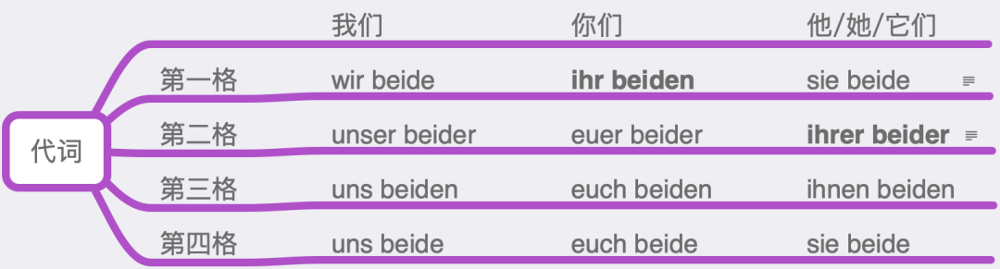

# 代名詞

## 定義

代名詞は人、物、概念、状況を表す。最も重要な機能は名詞の代用である。

代名詞は人称代名詞、所有代名詞、指示代名詞、関係代名詞、再帰代名詞、疑問代名詞、不定代名詞、代名詞esに分類される。

## 人称代名詞＆所有代名詞

人称代名詞は人や事物を表し、単数と複数の区別があり、単数三人称には性の区別がある。

所有代名詞は所有関係を表し、人称代名詞の第二格から派生する。名詞の修飾語として用いる場合、その名詞の性・数・格と一致させる必要がある。

|  Mann  |  Kind  | Frau  | Leute  |
| :----: | :----: | :---: | :----: |
|  der   |  das   |  die  |  die   |
|   er   |   es   |  sie  |  sie   |
|        |        |       |        |
|  des   |  des   |  der  |  der   |
|  sein  |  sein  |  ihr  |  ihr   |
| seiner | seiner | ihrer | ihrer  |
|        |        |       |        |
|  dem   |  dem   |  der  | den -n |
|  ihm   |  ihm   |  ihr  | ihnen  |
|        |        |       |        |
|  den   |  das   |  die  |  die   |
|  ihn   |   es   |  sie  |  sie   |

| wer  |    wessen    | wem  | wen  |
| :--: | :----------: | :--: | :--: |
| ich  | mein, meiner | mir  | mich |
|  du  | dein, deiner | dir  | dich |
| wir  | unser, unser | uns  | uns  |
| ihr  |  euer, euer  | euch | euch |

## 関係代名詞

関係代名詞は関係節の導入口である。

der*16

- 名詞には明確な性がある

|    Mann    |    Kind    |   Frau    |   Leute   |
| :--------: | :--------: | :-------: | :-------: |
|    der     |    das     |    die    |    die    |
|    der     |    das     |    die    |    die    |
|            |            |           |           |
|    des     |    des     |    der    |    der    |
| **dessen** | **dessen** | **deren** | **deren** |
|            |            |           |           |
|    dem     |    dem     |    der    |  den -n   |
|    dem     |    dem     |    der    | **denen** |
|            |            |           |           |
|    den     |    das     |    die    |    die    |
|    den     |    das     |    die    |    die    |

関係代名詞was

* 不定代名詞：nichts, alles, einiges, das ,vieles
* 文全体を指す
* 中性最上級：das Beste

構文

* Was ..., (das) ...
  * Was glänzt, (das) ist nicht unbedingt Gold.
* Wer ..., (der) ...
  * Wer zuletzt lacht, (der) lacht am besten.
  * Wer zuerst kommt, den werde ich loben.
* Wo ..., (da) ...
  * Wo ein Wille ist, da ist auch ein Weg.

関係節：der*16, was, wo

## 再帰代名詞

まず、「再帰」の意味を理解する必要がある。再帰とは、第三格または第四格目的語（前置詞が付加する第三格・第四格を含む）が主語と同じ人物または物を指す場合をいう。第二格も再帰に含まれるが、専用の再帰代名詞は存在せず、無視してよい。再帰代名詞で初心者が注意すべきは三人称単複数のsichのみで、他の人称は容易に理解できる。三人称sichが存在する意義は、曖昧さを回避する手段が追加される点にある：

Otto sagt, dass Karl ihn im Spiegel sieht. カールが見ているのはオットー

Otto sagt, dass Karl sich im Spiegel sieht. カールが見ているのはカール自身

次に、再帰を二種類に分類する：類推可能な理解と類推が困難なもの。素直に理解し、「真・偽・相互」といった文法用語に惑わされないこと。

Ich wasche das Auto. 物を洗うことができる

Ich wasche das Baby. 人を洗うこともできる

Ich wasche mich. 論理的には自分自身を洗うことも可能

Ich helfe dir. 他人を助けることができる

Wir helfen uns. 論理的にはお互いに助け合うことも可能です。

Er legt das Buch auf den Tisch. 静三動四の原則で、物を横に置く場所を表す；

Ich lege mich ins Bett. 論理的には自分を横に（寝かせて）置くことも可能。

Er ist sehr stolz auf seinen Sohn. 誰かを誇りに思うことができる；

Er ist sehr stolz auf sich. 論理的には自分自身を誇りに思うことも可能。

Im Kino sitzt ein großer Mann vor mir. 誰かや物が前にいる/ある状況；

China hat eine lange Geschichte hinter sich. 論理的には中国も長い歴史を背後に持つ（中国は悠久の歴史を持つ）。

しかし：

Du musst dich beeilen. 訳：急ぎなさい。

Das kann ich mir nicht vorstellen. 訳：これは想像できません。

Ich fühle mich zu dick. 訳：自分が太りすぎていると感じます。

これらの3つの例文は基本的に類推で理解するのは難しく、使用パターンを覚える必要があります：

sich beeilen（急ぐ）

sich etw. vorstellen（想像する）

sich irgendwie fühlen（～のように感じる）

つまり：類推可能な（疑似再帰）場合は直感と論理に従えばよく、英語のoneselfの用法に似ており、あまり力を入れなくてもよい；類推不可能な（真の再帰）場合は使用パターンを覚える必要があり、しっかり暗記しましょう。

第三に、格の問題：

1、類推可能な場合、必要な格を使用し、類推して使う。

2、一般的に：

2.1 sich V. の形の場合、sichは基本的に第四格、そうでない場合は第1点を参照；

2.2 sich etw. V. の形の場合、sichは基本的に第三格、そうでない場合は第1点を参照。

例えば：

sich anziehen （服を着る）sichは第四格；

sich etw. anziehen （具体的な服を着る）sichは第三格；

sich etw. überlegen （考慮する）sichは第三格、etw.が節になっても変わらない。

sich jm./etw. stellen （自分を誰かや物に向ける）sichは第四格、なぜなら自分が配置（縦に置く、立つ）の対象で、誰かや物が間接目的語だから。この文が難しすぎて格を覚えにくい場合は、簡潔で実用的な文を覚えることもできる：Er hat sich der Polizei gestellt. 訳：彼は自首した。sich der Polizei stellen（出頭する）。

sich jm./etw. nähern（誰かや物に近づく）sichは第四格。Niemand darf sich dem Kranken (dem Brandherd) nähern. 訳：誰も病人（火元）に近づいてはいけない。

実際のところ、直感や論理に合致しているか、用法パターンであるかにかかわらず、最終的には文や文章に落とし込み、以下の点をしっかりと行う必要があります：

語彙

用法パターン

文

場面（感覚）文章

この5つのレベルの積み重ねが日々の努力によって熟達し、自然と身につくことが最善の道です。多くの学習者は単語を暗記するだけに留まり、主に語彙のレベルしか積み上げていないため、当然ながら上達しません。

## 疑問代名詞

welch- どれ（限定された範囲）

was für (ein-) どんな（固定されていない範囲）

* Was für ein Mann ist er?
* Was ist er für ein Mann?

## 不定代名詞

不定代名詞は、人、物事、概念、状況を漠然と指すために用いられます。

### 人のみを指す場合

* man、jemand、niemand、jedermann、irgendwer
* 単数形で、格変化があります

### 物、概念、状況のみを指す場合

* etwas、nichts、viel、wenig、einiges、vieles、weniges、ein bisschen
* 格変化はありませんが、例外：einiges - einigem (D)、vieles - vielem (D)、weniges - wenigem (D)

### 人と物の両方を指す場合

* alles、alle、einige、manche、mehrere、viele、wenige、jeder（jede、jedes）、einer（eine、eines）、keiner（keine、keines）
* 単独で使用される場合は不定代名詞、名詞と共に使用される場合は不定数詞となります

* alle すべての+名詞、すべての人（単独使用）；alles すべての物や人（単数形）

#### 語尾変化

* alleとbeideのみが語尾変化します。

Sie fahren mit dem Bus. Wir ander_ gehen zu Fuß.

彼らはバスで移動し、私たち他の人は歩きます。

ここではanderenと記入すべきです。これは次のようにも理解できます：複数形のsie/Sieは定冠詞の複数形dieに由来するため、Sie/wir/ihrはすべて複数形のdieとして解釈されます。

しかし、問題はこれほど単純ではありません。例えば、人称代名詞の複数形に続くbeideの変化は把握が難しいです。

特に太字で示した2つの点に注意が必要です。

ihr beide という表現も存在しますが、古風であり、呼びかけの際には通常ihr beidenが用いられます。wir beiden という表現は存在しますが、非常に古風です。

「彼ら二人」の2格はihr beiderとも表せますが、非常に古風なため、使用は推奨されません。

さらにいくつかの例文を見てみましょう：

Wir beide waren dagegen. 私たち二人はこれに反対でした。

Mit ihrer beider Hilfe werden wir das schaffen. 彼ら二人の助けがあれば、私たちはきっとやり遂げられます。

Euch beiden herzlichen Dank! お二人に心から感謝します。

Für uns beide ist das wichtig. これは私たち二人にとって重要です。

## esの用法

* 中性単数名詞
* 主語
  * 主語の欠如（人 man、非人 es）
  * 形式主語
    * 節や不定詞を指す
    * 文頭に置き、文中の真の主語を指す（Es sind nur einige Studenten gekommen.）
* 形式目的語

## 冠詞から代名詞への変換

* まず名詞を付けたまま、通常通り表現する
* 名詞を除去
  * 冠詞や不定代名詞に語尾がある場合 --> そのまま保持
  * 冠詞や不定代名詞に語尾がない場合 --> 性別を示す語尾を追加
  * 冠詞や不定代名詞がない場合 --> welch-を使用
* 注意点
  * 無冠詞の代名詞にはwelch-を使用
  * 中性の-esは-sに変化可能