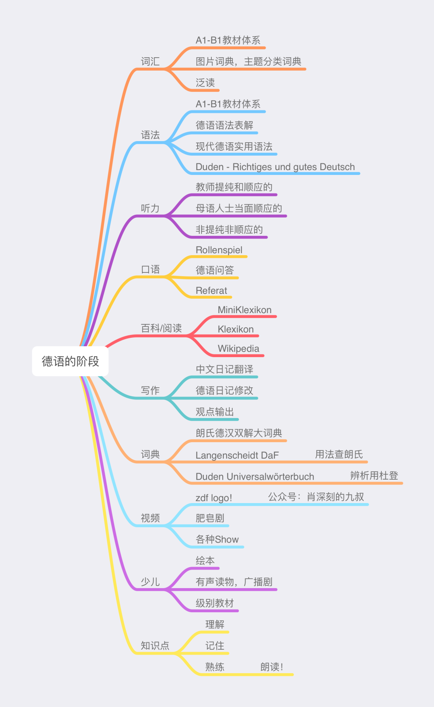
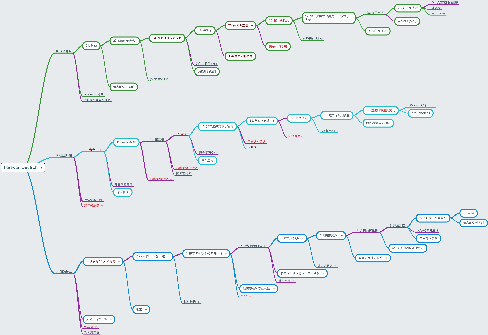
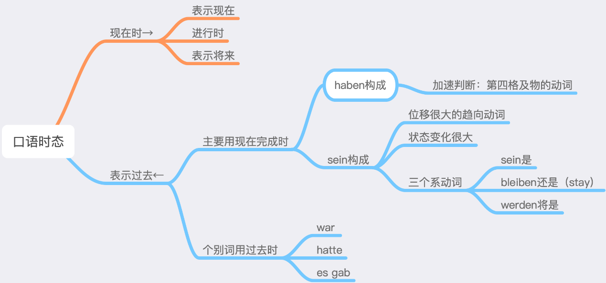
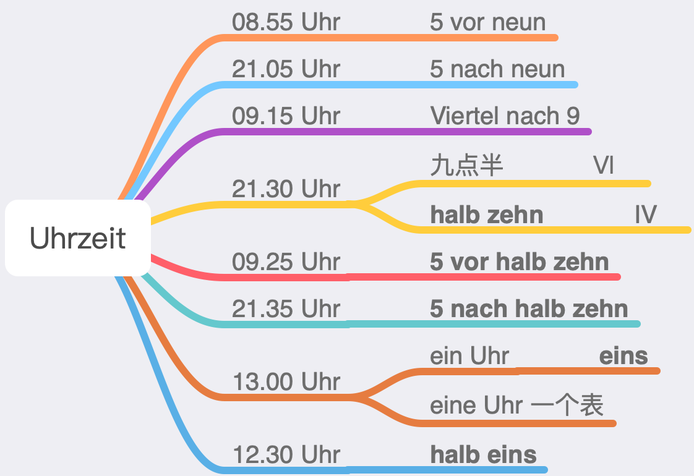

# その他

### ドイツ語学習の段階

最適なドイツ語学習の道筋は以下の通りです：

ステップ1：A1-B1教材体系を迅速にマスターする

可能な限り速いペースで、着実にA1-B1の教材体系全体を学び終え、外国語の「全体像」を把握します（多くの学習者は最初は盲人摸象のような感覚です）。この過程では他のことに気を取られず、理解に集中します。悩み過ぎず（学習者を悩ませる教え方は良い教え方ではありません）、しっかり記憶し、できれば重要なテキストを音読・暗唱しましょう。気付いているかもしれませんが、全ての外国語の優等生は教材の重要なテキストを全て暗唱できる能力を持っています。

ステップ2：青少年向けドイツ語ニュースを見る

ステップ1を基盤として、毎日青少年向けドイツ語ニュースを見て、ドイツ語を最新情報を得る（第一報の）チャンネルに変えます。毎日いくつかの単語や表現を積み上げ、日々蓄積していきます。学習は生活と結びつき、生活の一部にならなければなりません！信じてください、zdf logoは毎日のドイツ語ニュース習得に最適なコンテンツです。そうでなければ、私たちも7年間ほぼ毎日、バイリンガル字幕付きの動画を更新し続けることはできなかったでしょう。他の毎日更新されるドイツ語ニュース番組は、堅苦しすぎ、退屈すぎ、（あなたの）現実とかけ離れているため、長く続けられません。注意：青少年向けドイツ語ニュースはあくまで「おやつ」であり、レベルを加速的に向上させるにはB2-C2レベルの学習を続ける必要があります。

ステップ3：ドイツ語のソープオペラを見る

「没入型」でドイツの現実生活に最も近いのがドイツ語のソープオペラです。ほぼ毎日1話更新され、あっという間に数千話に達するようなテレビドラマで、まるでドイツのあちこちにカメラを設置し、ある場所の一群の人々の日常生活を50分に圧縮して見せているようなものです。例えばSturm der Liebeというドラマがあります。アメリカのテレビドラマと比べると、もちろんそれほど魅力的ではなく、むしろ田舎臭く感じたり、ストーリーに腹が立つこともありますが、これが現実の生活です。現実の生活には爽快な展開も、笑いのネタも、超凡脱俗な要素もそれほど多くありません。あなたが見るべきは、どんな人がどんな文脈でどんな発言をしているかであり、ドイツ人の日常生活に没入して体験することです。

注意：完璧主義にならないこと

青少年向けドイツ語ニュースやドイツ語の昼ドラを見ることは、あくまで「おやつ」のようなもので、完璧主義にならず、継続が重要です。無理に理解しようとせず、聴き取れるレベルに達していない場合は、まずレベルアップを目指しましょう。毎日続け、いくつかの単語や表現を学べば十分で、欲張らないこと。すべての教材を精読・精聴に変え、数日で熱意を燃やし尽くし、中途半端に終わらせないでください。多読・多聴の目的は、興味を育み、語感を養い、熟練度を高めることであり、それ以外ではありません。ドイツ語で情報を吸収し、ドイツ語で楽しみ、生活の一部にし、日々、年々と継続すること。電子辞書の単語帳が毎日増えていき、時々復習する。これが最良の学習モデルです。

### 基本文法フレームワーク

これはドイツ語の基本文法フレームワークで、A1からB1の3つのレベルに分布しています。

- 紫色の線は、3つの性と4つの格に関連することを示します。
- 角丸の枠は、英語の文法との類似性が高いことを示します。
- 赤い文字は学習難易度が高いことを示します（明るい赤ほど暗い赤より難易度が高い）。

これら3つのマークがない部分は、一般的に小さな知識点で、理解も記憶も難しくありません。

上図からわかること：

1. ドイツ語と英語の文法フレームワークは全体的に類似しています。
2. ドイツ語の特徴的な文法は、基本的にすべて**3つの性と4つの格**に関連しており、言い換えれば：3性4格から派生したドイツ語特有の文法があります。例えば形容詞の変化や関係節などです。
3. 難しい文法はそれほど多くありません。赤でマークされた知識点の中には、理解が特に難しいわけではなく、記憶量が大きいものもあります。一部は英語との差異が大きいため、忘れやすいという特徴があります。

そこで、ドイツ語の**三大基本スキル**をまとめます：

1. 名詞の性（と数）
2. 不規則動詞表
3. 名詞、動詞、形容詞の用法構造（Strukturformel）。

この三大基本スキルがしっかりしていれば、ドイツ語ができないということはあり得ません。

**3性4格**はドイツ語の魂です。3性4格がなければ、ドイツ語は基本的に英語になってしまいます。そのため、最初から名詞の性を正確に覚えることが、ドイツ語学習の鍵中の鍵です。多くの人はこの心構えがなく、3性4格を拒否し、曖昧に覚えるため、基礎が固まらず、後で修正が難しくなります。

### 口語時制

### 時間表現

### 度量衡

* 度量衡は常に第四格を使用する