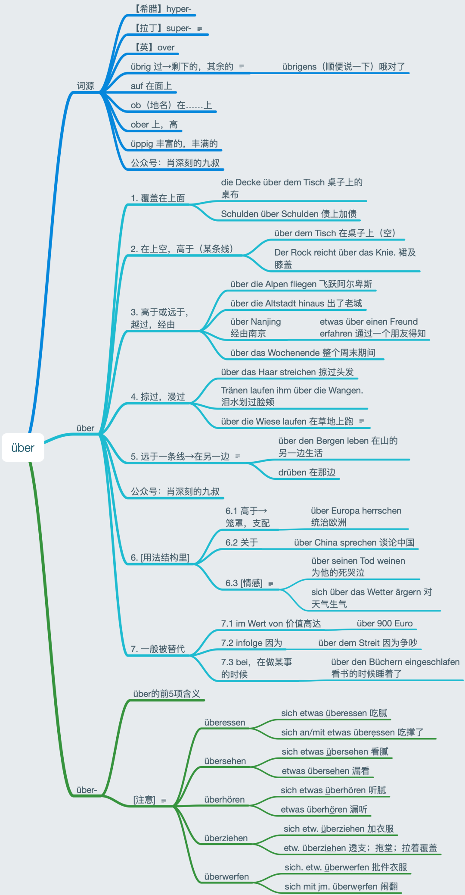

# 動詞の接頭辞

接頭辞は分離接頭辞と非分離接頭辞に分かれ、それによって動詞も分離動詞と非分離動詞に分類されます。両者を区別する重要なポイントは、異なる時制における動詞の変化形です。非分離動詞を過去分詞（PII）に変化させる際には、接頭辞の後にge-を追加しないように注意してください。非分離接頭辞はアクセントが置かれず、アクセントは接頭辞の後の動詞部分に置かれます。

## 非分離接頭辞

### be-

自動詞を他動詞に変えます。例：antworten vi. 答える → beantworten vt. 答えさせる；malen vi. 絵を描く → bemalen vt. ～に絵を描く。

be-の動詞は約400語あり、99%が他動詞で第四格を取ります。本当の例外はjm./etw. begegnen（出会う）とjs./etw. (G) bedürfen（必要とする）の2つだけで、前者は第三格、後者は第二格を取ります。それ以外で第四格を取らない場合は、再帰代名詞sichの第四格を使うか、人に第三格・物に第四格を取る（稀）かです。目的語を取らないものもありますが、極めて特殊な語彙であり無視できます。

be-の語源は役に立ちませんので、気にしないでください。

### emp-

特定の感覚やサービスを強調します。例：fehlen 欠ける、恋しく思う → empfehlen 推薦する；fangen 捕まえる → empfangen 迎える、接待する。

### ent-

基本語の意味と反対の意味を表します。例：decken 覆う → entdecken 発見する；spannen 緊張させる → entspannen リラックスさせる、緩和する。

### er-

動作の完了や最終結果を表します。例：bauen 建設する → erbauen 完成させる；arbeiten 働く → erarbeiten 獲得する、稼ぐ；lernen 学ぶ → erlernen 習得する。

er-の動詞は比較的少なく、200語未満です。意味のバリエーションも少なく、主に3つの大きなカテゴリーに分かれます。第3カテゴリーの語彙は多くありません。

er-と-ieren接尾辞を同時に持つ動詞は存在しませんが、ver-は-ieren接尾辞を取ることができます。erfrierenとeruierenは例外で、これらの-ierenは接尾辞ではなく語幹の一部です。

er-に比較級を組み合わせて形成される語はerleichternとerweiternの2つだけです。しかしver-に比較級を組み合わせた語は多く存在します。

### ge-

元の動作を強調します。例：gestalten 始める；gefallen 気に入る。

### miss-

基本語の意味と反対の意味を表します。例：verstehen 理解する → missverstehen 誤解する；trauen 信頼する → misstrauen 信用しない、疑う。

### ver-

元の動作の強化または元の動作と反対の意味を表します。例えば：bessern（修正）→ verbessern（改善、良くなる）；suchen（探す）→ versuchen（試す）；kaufen（買う）→ verkaufen（売る）；sehen（見る）→ versehen（見間違える）。

ver-の動詞は500以上あります。er-の第一項は形容詞から動詞への変化のみですが、ver-の第一項には名詞も含まれ、すべて他動詞です。ver-の最後の2項「死亡」と「他動詞化」の語はほとんどありません。「間違い」の項はすべて再帰的です。「死亡」を表すver-は図にある2つだけですが、er-には多くの「死亡」を表す動詞があります。

### zer-

「壊す」「破壊する」という意味を表します。例えば：brechen（折る）→ zerbrechen（粉々にする）；stören（邪魔する）→ zerstören（破壊する）；reißen（引き裂く）→ zerreißen（引き裂く、破る）。

## 分離可能な接頭辞

### ab-

「落ちる、取り外す、分離する、除去する、離れる」という意味を表します。例えば：bauen（建てる）→ ab/bauen（取り壊す）；schneiden（切る）→ ab/schneiden（切り取る）；drängen（押す）→ ab/drängen（押しのける、排除する）；brennen（燃やす）→ ab/brennen（焼き尽くす）；fahren（運転する）→ ab/fahren（出発する、立ち去る）。

### an-

「動作の継続」「方向性」「接続、接続する」という意味を表します。例えば：kommen（来る）→ an/kommen（到着する）；fragen（尋ねる）→ an/fragen（質問する）；fliegen（飛ぶ）→ an/fliegen（～に向かって飛ぶ）；rennen（走る）→ an/rennen（走って向かう）；schalten（操作する）→ an/schalten（電気機器をオンにする）；gehen（行く）→ an/gehen（電気機器が点灯している）。

本当の例外はetw. (D) angehören（属する）とetw. haftet jm./etw. an（付着する、くっつく）の2つだけです。後者は実際にはより一般的な前置詞構造（同じ意味）があります：etw. haftet an jm./etw. an。その他、第四格を取らないものは、人三物四か、特に理解しやすい目的語を取らないものです。

### auf-

「上向き」または「開く」という意味を表します。例えば：gehen（行く）→ auf/gehen（上昇する、上がる）；stehen（立つ）→ auf/stehen（立ち上がる）；packen（包む）→ auf/packen（包みを開ける）。

### aus-

「外に出る」または「消す」という意味を表します。例えば：füllen（記入する）→ aus/füllen（記入し終える、埋める）；geben（与える）→ aus/geben（支出する、引き渡す）；brennen（燃やす）→ aus/brennen（燃え尽きる）；machen（する）→ aus/machen（消す）。

### bei-

「付加」「参加」または「貢献」の意味を表します。例：legen（置く）→ beilegen（同封する）、schreiben（書く）→ beischreiben（付記する）、treten（踏む）→ beitreten（加入する）、tragen（運ぶ）→ beitragen（貢献する）。

接頭辞bei-も「付随」の意味です。動詞接頭辞では「付加する、傍らに」の意味、名詞接頭辞では「二次的な、副次的な」意味で、同源の英語by-と同じです。英語bypass（迂回路）を参照。

### ein-

外向きから内向きの動作「中へ」「進入」を表します。例：atmen（呼吸する）→ einatmen（吸い込む）、kommen（来る）→ einkommen（収入）。

### fort-

「離れる」または「継続」の意味を表します。例：bringen（持ってくる）→ fortbringen（持ち去る）、treiben（追い立てる）→ forttreiben（追い払う）、bestehen（存在する）→ fortbestehen（存続する）、wirken（作用する）→ fortwirken（影響を及ぼし続ける）。

### mit-

「一緒に」または「携帯する」の意味を表します。例：arbeiten（働く）→ mitarbeiten（協力する）、nehmen（取る）→ mitnehmen（持っていく）。

### nach-

「後で」または「特定の目標に向かって」の意味を表します。例：lernen（学ぶ）→ nachlernen（追い学習する）、blicken（見る）→ nachblicken（見送る）。

分離接頭辞nachの意味は「～の後に」と高度に概括できます。

### nieder-

「下方へ」「打倒」の意味を表します。例：biegen（曲げる）→ niederbiegen（下方へ曲げる）、schlagen（打つ）→ niederschlagen（打ち倒す）。

### vor-

「事前に」「～の前に」「～の前へ」の意味を表します。例：vorarbeiten（下準備する）、vorhängen（前に掛ける）、vorfahren（前進する）。

### zu-

「方向」の意味を表します。例：zuschicken（送り届ける）、zuschießen（射掛ける）。

分離接頭辞zuの意味は2つしかなく、どちらも「矢印」のイメージで統一できます。

zugehenやzufahrenなどの分離動詞の構文は全て「auf jn./etw. zugehen/zufahren」です。元々は分離動詞ではなく「auf...zu」の前置詞構文「～の方へ、距離を縮めて合流する」でしたが、文には動詞が必要なため、後置のzuが動詞と結合して分離動詞になったものです。

## 分離と非分離の両用

分離可能と非分離可能の両方の性質を持つ接頭辞は3組あります：静三動四の前置詞における対義語のüberとunter、語源が同じwiderとwieder、第四格のみを取るumとdurchです。最も信頼できる方法はアクセントの位置で判断することです：接頭辞にアクセントがある場合は分離可能、動詞にアクセントがある場合は非分離可能です。über、unter、um、durchの4つの接頭辞を持つ動詞については、規則性が強くない（あったとしても覚えられない）ので、一つ一つ確実に覚えていくのが良いでしょう。

###  über-

特に注意すべきは、über-で構成される動詞は分離可能な場合も非分離可能な場合もあり、さらに一部の動詞は両方の性質を持つことです。über-で構成される動詞は約90個あります。分離可能なものはフレーズのように感じられ、非分離可能なものは接頭辞によって意味が微調整された単語のように感じられます。特に、食べ飽きる、見飽きる、聞き飽きるの3つの動詞はすべて分離可能です。

語源的なüberの理解は非常に役立ちます。ラテン語のsuperが少し異質に感じられるのは、これが複合語であり、sはexの名残だからです。

überの最初の5つの意味は、高度に曖昧ながらも統一することができます。つまり、静三と動四における「上を越える」と「遠くへ」の概念です。aufとは異なり、aufは比較的平らな面上にあることを強調します。

第4項の3つ目の例文に注意してください。人も「飛び越える」対象になり得ます。この項目は見落としがちです。

第5項をしっかり理解すれば、rüberも理解できるようになります。rüberは同一平面上の移動を表し、drübenは同一平面上の「あそこ」を意味し、英語のover thereに相当します。ここでも語源の知識が役立ちます。

第1-5項のプレースホルダーはwoまたはwohinです。第6項ではこれらの単語を使うことができず、用法構造において必ずüberを明記する必要があります。第6項の3つの小項目には多くの例があり、これらを高度に統一して理解することは非常に啓発的です。これは私が最も誇りに思っている点の一つです。

英語のaboutに相当する「～について」の意味ではüberを使用します。感情に関する用法構造の前置詞は2つあり、一つはüber、もう一つはaufです。überは既存のものに対する感情を表し、aufは未来のものに対する感情を表します。

第7項はあまり重要ではないので、軽く目を通す程度で、覚えられなくても問題ありません。

接頭辞über-にはüberの最初の5つの意味があり、ここでは繰り返しません。

### wider-

wider-を接頭辞とする動詞は、Dudenに17個収録されています。「反射」を表すいくつかの単語が分離可能であるのに対し、それ以外はすべて非分離可能であることがわかります。

### wieder-

wieder-を接頭辞とする動詞は、Dudenに46語収録されています。wiederholenは分離可能でも非分離可能でも使用されますが、分離用法の意味項目はLangenscheidt辞典に掲載されておらず、使用頻度も低いため、学習者はwiederholenを非分離動詞と見なして構いません。「回復」を表す4つの動詞が非分離である以外は、すべて分離可能です。ただし、「回復」を表す4つの動詞もLangenscheidt辞典には収録されていません。つまり、実質的に非分離のwieder-動詞はほぼ存在しないと言えます。

## 接頭辞の識別

接頭辞を持つ動詞は、その意味項目がどれだけ多くても、必ず接頭辞と動詞の基本意味に関連しています。

### nehmen

一覧にすると非常に壮観です。まとめて見ることで類義語の区別も容易になります。

実はgenehmigen「（公的に）承認する」もnehmenと関連しており、genommen（受け入れ可能）であることを意味します。vornehmは前方に置かれたもので、「上品な、優雅な」という意味です。nehmenの古い名詞形に-nunftがあり、Vernunft（理性）などがこれに当たります。この語はnehmen（受け取る）→wahrnehmen（注意→知覚）→vernehmen（聞く）→Vernunft（年長者の言葉を聞く→理性）という発展を経ています。

nehmenはDudenで24の主要な意味項目があり、細分化するとさらに多くなりますが、「取る、奪う、獲得する」も「食べる」も、英語のtakeと同様に理解できます。

nehmen, einnehmen, nachnehmenには全て「食べる」の意味があります。「薬を飲む」には主にeinnehmenが使われますが、nehmenも可能です。「飲食する」の意味ではeinnehmenとnehmenはどちらもやや格式ばった表現です。nachnehmenは「追加で飲食する」の意味で、接頭辞nachには「後に～する」の意味があるためです。例：Nimm dir doch noch etwas Reis nach.（もう少しご飯をお代わりしなさい）。中国語に「吃我一拳」、英語にI'm taking fire、ドイツ語にEr musste mehrere Haken nehmen（何発もフックを食らった）といった表現があります。

どの接頭辞を持つ動詞でも、その意味項目がどれだけ多くても、必ず接頭辞と動詞の基本意味に関連しています。例えばabnehmen：

上図の全ての意味項目はnehmen（take）とab（off）に関連しており、それらだけに関連しています。ab (off) は中国語の「下、掉、走」に類似しています。

aufとabは反意語で、auf (up) は「上、起、来」を意味します。aufnehmenは今日でも最も原始的な意味「地面から拾い上げる」を保持しており、そこから「抱き上げる」→受け入れる→加入させる→吸収する→（作品を）受容するなどの意味が派生しました。

「an」は「近づく、初歩的、少し」という意味であり、したがって「annehmen」には「受け入れる、承諾する」という意味があります。「annehmen」と「aufnehmen」は時に区別が難しい場合があります。「annehmen」は主に「受け入れる」を意味し、「aufnehmen」は主に「受け取る」を意味します。「annehmen」には「養子にする」という意味もあります（「an」には同化のニュアンスがあるため）。一方、「aufnehmen」には「収容する」という意味があります（「auf」は引き上げるニュアンスがあるため）。「annehmen」と「aufnehmen」の両方に「入学させる/採用する」という意味もあります。

### fordern（要求する）

「fordern」（要求する）は「vorder」（前）から派生しました。「vorder」は「vor」の古い比較級です。「さらに前へ→要求する」という発展です。誰かを外に要求する（「herausfordern」）なら「挑戦する」という意味になり、『三国志演義』の罵陣を思い起こさせます。

「fördern」（促進する）は現代ドイツ語では消滅した比較級「fürder」（さらに遠く、前に）から派生し、英語の「further」（促進する）と同源です。「さらに遠くへ、前進させる→促進する」という流れです。「fürder」の原級は「fort」（前に、離れて）で、「vor」と同じ語源です。

ドイツ語：vor - vorder - vorderst, fort - fürder  
英語：fore - further - first, forth - further, far - farther

「fördern」は「fürder」（さらに遠く、前に）に由来するため、元々は「運送する」という意味もありましたが、現在ではこの意味は「befördern」で表現されます。「鉱石を運び出す」ことから、「fördern」には「採掘する」という意味もあります。

「促進する」は基本的に「fördern」のみですが、「要求する」には複数の表現があります。どう区別すればよいでしょうか？

簡単に言えば、「verlangen」は「欲しい」というタイプの「要求」で、「渴望」に関連します（名詞「Verlangen」＝熱望、渴求を参照）。「fordern」は「主張して求める」タイプの「要求」です（名詞「Forderung」＝要求を参照）。「erfordern」は「必要がある」タイプの「需要」で、形容詞「erforderlich」（必要な、必須の）と関連します。マインドマップの例文は折りたたまれているため、開くと文字が読みづらくなるかもしれません。

多くの学習者がさまざまな接頭辞が付いた動詞（特に「-fordern」系）に頭を悩ませています：

実は、前置詞の深層的な意味を理解すれば、これらの単語を並べて理解することは簡単です。前置詞の深層的な意味を理解するには、前置詞の各意味を一つのイメージに統合し、語義の発展経路を整理する必要があります。

まとめ：

「fordern」と「fördern」はどちらも「vor」から派生しましたが、異なる道をたどりました。ドイツ語には「vor」から派生した意外な単語（例：「fremd」）が多数あり、英語にも同源語（例：「from」「prime」）が多く存在します。

## 例外

- (jm.) etw. gewährleisten（保証する、確保する）は名詞＋動詞の構造で、分離不可。

- schlafwandeln（夢遊病）は名詞＋動詞の構造で、分離不可。

- etw. absorbiert etw.（吸収する）は前置詞＋動詞の構造で、分離不可。

- etw. absolvieren（修了する）は前置詞＋動詞の構造で、分離不可。

- etw. aus etw. abstrahieren（……から抽象化する）は前置詞＋動詞の構造で、分離不可。