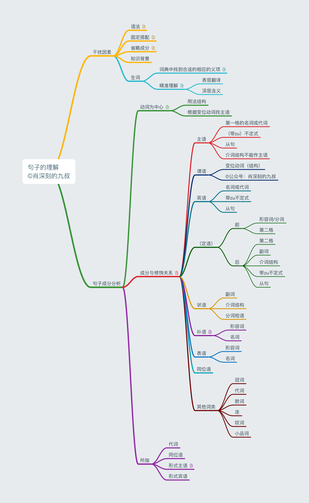

# 構文

## 構成

### 文の成分

ドイツ語の文には理論上動詞が必須であり、一般的には主語も必要です。省略文では成分が欠ける場合がありますが、規則に従って補完可能です。ドイツ語の文成分は「主語・述語・目的語・状況語・補語・表語」の6種類のみです。品詞は主に「名詞・動詞・形容詞・数詞・冠詞・代名詞・副詞・前置詞・接続詞・小詞（実質的に間投詞）・感嘆詞」の11種類で、「小詞」とは「小品詞」（実際には終助詞）を指します。

### 基本文型

ドイツ語も5つの基本文型に分類でき、全ての文はこれらの文型を基に変化します（従属節を含む）。文全体が成分として機能する場合が従属節であり、どの成分として機能するかで節の名称が決まります（例：主語として機能すれば主語節）。ドイツ語の従属節には理論上、全てに導出語があり、また活用動詞は最終位置に配置されます。この2つの特徴により、英語の従属節よりもはるかに識別が容易です。

### 語順

動詞の第二位という原則を除けば、他の成分は全て前倒し可能です。ただし、一度に一つの成分のみを移動させ、主語を活用動詞の後ろに押しやり、他の成分は元の位置を保持します。

te,ka,mo,lo：時間（temporal, いつ？）、原因（kausal, なぜ？）、様態（modal, どのように？）、場所（lokal, どこ？）

## 与格（第三格）

ラテン語の慣例に従い、第一格は主格、第二格は属格（所有格）、第三格は与格、第四格は対格となります。英語と比較して、ドイツ語には第三格が追加されており、常に理解の障壁となります。

第三格の用法は以下のように要約できます：

1. 静三動四：9つの前置詞 über, auf, in, unter, vor, hinter, neben, an, zwischen に関連
2. 人三物四：間接目的語（例：Ich gebe dir ein Buch.）
3. 前置詞固定で第三格を要求：aus, seit, mit, nach // von, bei, zu // außer, gegenüber
4. 形容詞的用法：「第三格」に対して（例：Mir ist kalt. Es ist mir kalt.）
5. 動詞固定で第三格を要求（例：Ich helfe dir.）

前4項目は論理が単純で理解しやすいですが、第5項目が難点であり、本日の解説の焦点です。

動詞に第四格が伴う場合、主語が対象に直接作用すると解釈できます（例：Sie schlägt ihn. 彼女は彼を殴る）。一方**動詞に第三格が伴う場合、主語が対象に間接的に作用すると解釈できます**（例：Ich helfe dir. 私はあなたを助ける）。

この「間接的な作用」は少し神秘的に感じられるでしょうか？実はこういうことです。例としてhelfen（助ける）を取り上げましょう：ラテン語の対応する動詞はassistereで、英語ではassistになりました。asは前置詞から来ており、語根sistは「立つ」という意味です。ドイツ語にはbeistehenという翻訳借用語があり、assistereを文字通り訳したものです。assistereはラテン語で第三格を取りますが、beistehenも第三格を取ります。これは論理的で、stehen（立つ）が第四格を取るか直接作用と解釈するのは全く不合理です。実はhelfenは本来第四格を取っていました。レッシングやゲーテの作品にもそのような文例が見られます。おそらくassistereとbeistehenの影響が強すぎて、次第に第三格のみを取るようになったのでしょう。

こう考えると、jm. entkommen（誰かから逃れる）、jm. hinterherlaufen（誰かを追いかける、求愛する）も容易に理解できます。これらの語根はもともと他動詞ではないので、その派生語や複合語が第三格を取るのは当然のことです。

jm. danken（誰かに感謝する）も同様の理屈です。dankenはdenken（考える）から来ており、元々は「心の中で誰かを覚えておく」という意味でした。「考える」にせよ「感謝する」にせよ、対象に対する間接的な作用です。うーん、また少し神秘的な話になりました。心理や精神に関する動詞が取る格や前置詞については、すぐに納得できる説明を見つけるのはまだ難しいようです。引き続き努力します。

第三格を取る一部の動詞は、後から補足された文要素と見なすことができます。第四格は基本的に不可欠ですが、第三格目的語は後から補足された文要素と見なせます。例えば：Du fehlst mir.（君がいなくて寂しい）：Du fehlst.（君がいない）。誰にとってかというと、mir（私にとって）。またDas schmeckt mir.（この味が好き）：Das schmeckt (gut).（この味は良い）。誰にとってかというと、mir（私にとって）。

このような状況は他の言語にも見られます。例えば：

ラテン語：Nomen mihi est Marcus.（私の名前はマルクスです）：Nomen est Marcus.（名前はマルクスです）。その後で補足して、mihi（私にとって）。

日本語：「は」の前は主格に近く、「が」の前は第三格に近い。

中国語：王冕死了父亲。（王冕は父親を亡くした）

中国語から日本語に翻訳：王冕が父に死なれた。

さらにドイツ語に翻訳：Wang Mian (第三格) ist der Vater weggestorben.

* 男性名詞と中性名詞の単数第三格には-eを付けることができ、古風な響きになります。

## 人三物四

両方が名詞の場合、第三格が前；一方が代名詞の場合、代名詞が前；両方が代名詞の場合、第四格が前

* その子の母親は学生に本を一冊渡す。
* 彼女は彼に本を渡す。
* 彼女はそれを学生に渡す。
* 彼女はそれを彼に渡す。

見せてあげる。（Ich zeige es dir.）

## 二つの対格

Das traue ich mich nicht. つまり「sich trauen, etw. zu tun」の「etw. zu tun」が「das」に変わった形。

「fragen」には「(jn.) (etw.) fragen」という用法構造がある。ここでの「etw.」は疑問文で、例えば：Er fragte (sie), ob sie mit ihm ins Kino gehe.（彼は（彼女に）、一緒に映画に行かないかと尋ねた）。

「zu不定詞」と「従属節」は「was」や「etwas」に「圧縮」可能で、圧縮後に二つの対格が現れる場合がある。

二つの対格を取る動詞として、基礎教育では通常「kosten」と「nennen」のみ教える。これ以外にも二つの対格を取る動詞は存在するが、主に「zu不定詞」や「従属節」が「was」や「etwas」に圧縮された場合に発生し、他の名詞が目的語になることは稀。

「heißen」や「schimpfen」も二つの対格を取る動詞で、例えば：Sie schimpft ihn einen Betrüger（彼女は彼を詐欺師だと罵る）。ただしこれらの動詞は「nennen」の用法に近く、意味や使い方が類似している。

「lehren」も二つの対格を取ることが可能で、例えば：Er lehrt mich die französische Sprache（彼は私にフランス語を教える）。ただし「Er unterrichtet uns in Franzöisch」の方がより一般的なため、通常は「lehren」が二つの対格を取る点は見過ごされがち。

「(jn./jm.) (etw.) abfragen/abhören」のような両義的なケースは、誤用の可能性が極めて低いため教育上無視して問題ない。近年では「人に第三格・物に第四格」の用法が直感的であるため普及しつつある。

非常に頻繁に用いられる表現：Das geht dich einen Dreck an（君には関係ないことだ）。これは明らかに二つの対格を取る構造。

## 否定

* nicht
  * 否定対象の要素の直前に配置
  * 動詞を否定する場合は文末に配置
* kein

## 状況語

### 第二格による状況語

* 第二格の状況語は独自に創作不可
* 時間表現
  * ある晩
  * ある日
* 重い心で彼は街を離れた。

## 関係節

関係代名詞には5つの主要カテゴリが存在し、各カテゴリ内にサブ分類や注意すべき詳細事項が含まれる場合がある。

基礎段階では「der」の16バリエーションと「was」「wo」、さらに「wer ..., der ...」と「was ..., das ...」の2構文を習得すれば十分。

* 定冠詞
  * der, die, das, die
  * den, die, das, die
  * dem, der, dem, den -n
  * des, der, des, der
* 関係代名詞
  * der, die, das, die
  * den, die, das, die
  * dem, der, dem, **denen**
  * **dessen, deren, dessen, deren**
* Ein Student ist ein Mann, der an der Uni studiert. （学生とは大学で学ぶ男性である）
* Das ist der Mann, der Chinesisch spricht. （これは中国語を話す男性です）
* Das ist die Frau, der ich geholfen habe. （これは私が助けた女性です）
* Das sind die Leute, denen ich danke. （これが私が感謝する人々です）
* Ich habe dem Kind, mit dem mein Sohn in die Schule geht, geholfen. （息子と一緒に学校へ行く子供を助けました）

## 文の変化

|   连词    |       介词       |       副词       |              |
| :-------: | :--------------: | :--------------: | :----------: |
|  während  |   während + G    |  währenddessen   |  在...期间   |
|   bevor   |     vor + D      |   davor/zuvor    |  在...之前   |
|  nachdem  |       nach       |      danach      |  在...之后   |
|   seit    |       seit       |     seitdem      |  从...以来   |
|  obwohl   |    trotz + G     |     trotzdem     |     尽管     |
| (an)statt |  (an)statt + G   |   stattdessen    |    而不是    |
|   weil    |    wegen + G     | deswegen/deshalb |     因为     |
| als/wenn  |       bei        |        da        |   当...时    |
|   damit   |      zu/für      |      um zu       | 目的（为了） |
|   indem   | dadurch dass + G |      durch       | 方式（通过） |

## 小辞

* 文中；強勢を置かない
* doch：陳述や命令の調子を強める
* ja：周知の事実
* denn：疑問の調子
* eben：その通り
* einfach：ただ
* eigentlich：実際は

## 特殊な現象

言語にはいくつか比較的珍しい文法があります。例えば：

Absentiv（日本語訳がまだないため「離缺時」と呼ぶ）：sein動詞と動詞の原形を用いて、現在または直前に何をしたかを表す。例：Er ist schwimmen. （彼は泳ぎに行った）Ich war einkaufen. （買い物に行った/さっき買い物をしていた）文法書には通常記載されていないが、口語ではよく見られる現象。

Genitivus absolutus（「第二格の副詞的用法」と呼ぶ）：これは「第四格の副詞的用法」とは大きく異なり、「第四格の副詞的用法」は生産性がある（論理に従って自由に作れる）が、「第二格の副詞的用法」には生産性がなく、一つ一つ覚えるしかない（数も少ない）。「固定表現」として覚えることをお勧め。例：schweren Herzens （重い心で）

am-Progressiv（「am進行形」と呼ぶ）：ドイツ語には進行形がなく、中国語と同様に時間を表す副詞で表現するが、口語では「進行形」の代用と見なせる形式がある：Er ist am Arbeiten. （彼は仕事中です）

freier Dativ（自由第三格）：統語的には必要ないが、追加できる第三格。例：Dass du mir ja nicht zu spät kommst! （遅刻しないでね）これは中国語の「給我」と感覚が似ている。ドラマではStirb mir bitte nicht (weg)! （死なないで）という表現も見た。

ドイツ語には他にも間違いやすい文がある：

Aller Anfang ist schwer. （物事は始めが難しい）

これは古ドイツ語の名残。現代ドイツ語ではほぼ全て複数形が使われる（例：alle Studenten）

Aller guten Dinge sind drei. （良いことは三つ）

英語で理解すると分かりやすい：Of all good things there are three. （ofが使われているので当然第二格になる）

Stille Wasser sind tief. （静かな水は深い）

水域中の水の塊は複数形で表現することができますが、複数形が使われるケースは非常に稀なため、この諺は間違いやすいです。水を一塊一塊と捉えるのは確かに難しいですが、ドイツ人には可能です。彼らは空気さえも塊として捉えることができ、「an die Luft（新鮮な空気を吸いに行く）」という表現が生まれます。室内と室外の空気が明らかに異なる塊として認識されているからです。「in die Luft（爆発して空中へ）」とは異なることに注意が必要です。

以上の現象はよく考えれば理解できますが、以下のものは説明が困難です：

Du hast gut reden/lachen. 高みの見物だ。

habenに動詞の原形が続くとは、どのような文法現象でしょうか？あらゆる解釈の試みが失敗に終わりました。

Er legt sich schlafen. 彼は横になって眠ります。

legenに動詞の原形が続くとは？zu不定詞を伴わない動詞のリストにはlegenは含まれていません。

Meine Uhr ist verloren gegangen. 私の時計がなくなりました。

gehenは動詞の原形をとるのでは？なぜここでは過去分詞が使われているのでしょうか？ドイツ語の知識を総動員しても、jn. gefangen nehmenに類似した例しか見当たりません。ただしjn. gefangen nehmenは説明可能で、gefangenを副詞または補語と解釈できます。etw. geschenkt bekommenと同様です。

Beigefügt/beiliegend erhalten Sie den Katalog. 同封資料としてカタログをお送りします。

実際、第一分詞のbeiliegendも第二分詞のbeigefügtも、文法規則に合致していません。なぜなら文型変換が不可能（論理的主語がSieのまま維持できない）ためです。しかし多くのドイツ人がこの表現を使用しているため、致し方ありません。

Mexiko-Stadt ist die größte Stadt der Welt, gefolgt von Shanghai und Peking. メキシコシティは世界最大の都市で、上海と北京がそれに続きます。

このfolgenは第三格をとる動詞なので、理論的にはこのように受動態を形成することはできません。しかしgefolgt vonという表現を多くのドイツ人が使用しています。おそらく英語のfollowed byの影響でしょう。