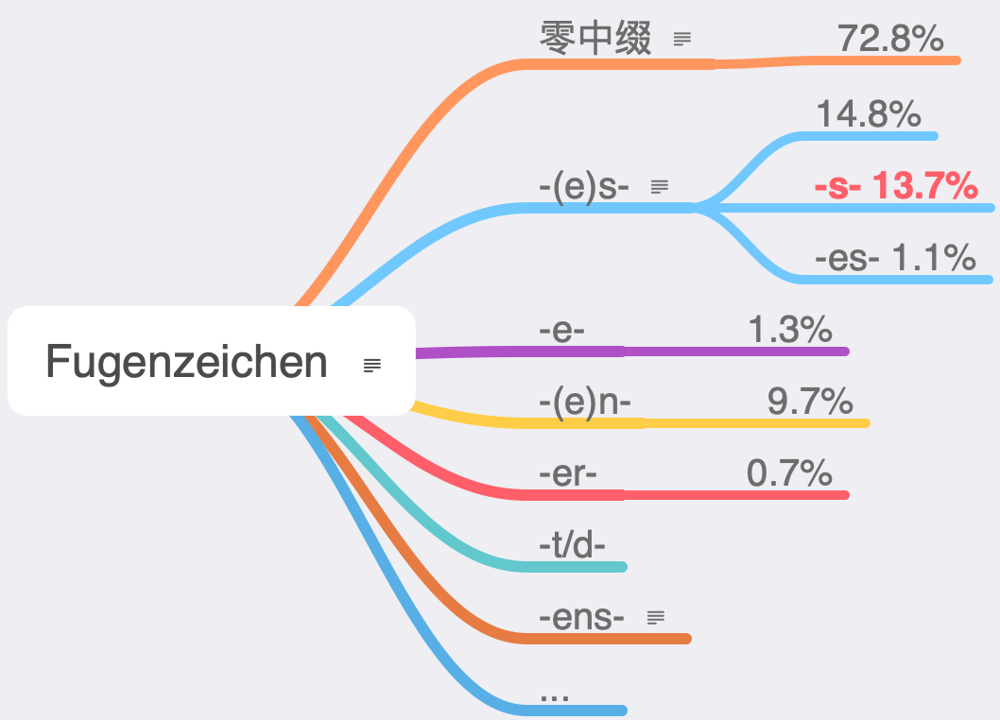
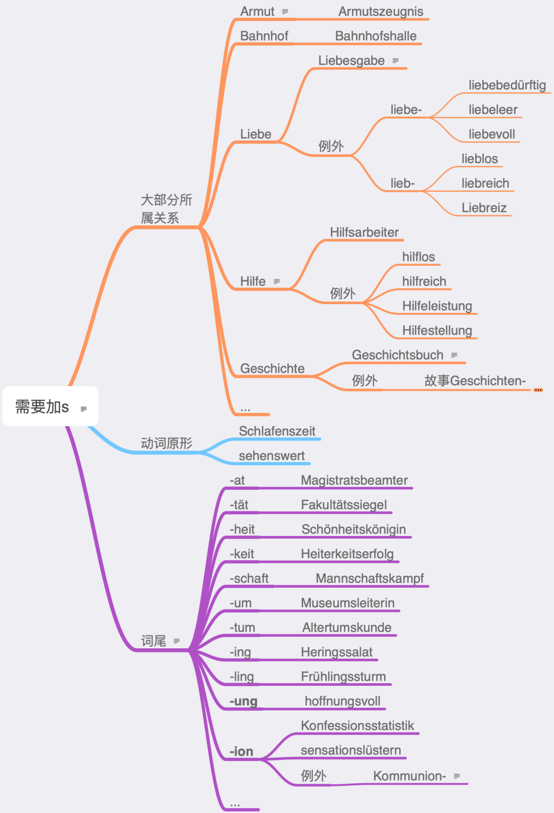
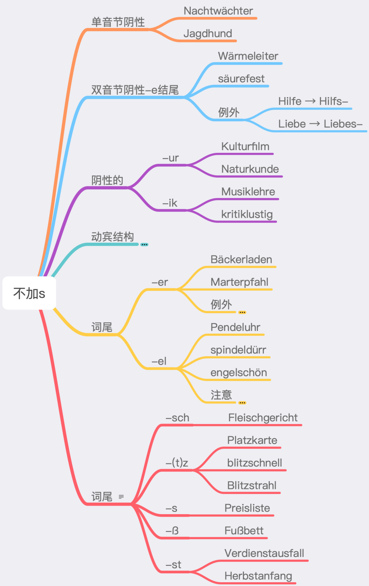
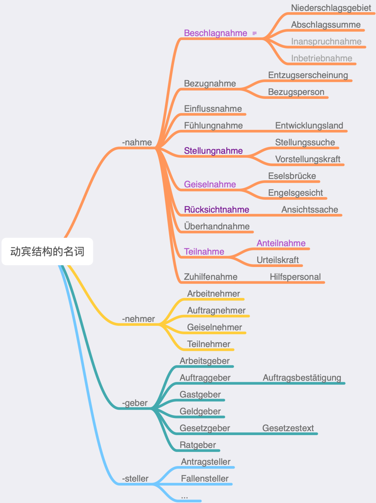

# 名詞複合中綴

複合語の中間にsを挿入するこの現象はドイツ語でFugen-s（中綴s）と呼ばれ、同様の中綴には他にもいくつか存在しますが、Fugen-sは最も一般的な中綴と言えます（文字を追加しない「ゼロ中綴」を除く）。データがこれを証明しています：

中綴は一般に古ドイツ語の第二格に由来します。例えばdes Bundes Tag → Bundestag, der Sonnen Strahl → Sonnenstrahlなど。または複数語尾に由来する場合もあります（例：Wörterbuch）。ただし、現在では一部の複合語は第二格や複数の関係では理解できず、第二格でない場合でもFugen-sが追加されることがあります。とはいえ、この点を理解することはFugen-sを習得する上で大きな助けとなります。

一、sを追加する必要がある場合

Liebeという単語がこれほど複雑なのは、古ドイツ語と中世ドイツ語にdas Liebとdie Liebeの2つの形があったためです。「愛の...」を表す場合は一般にLiebes-が使われ、後に所属関係を表さない場合もこれに倣うようになりました（例：liebesfähig）。

Hilfeが限定詞となる複合語は一見複雑に見えますが、実際には論理を見出すことができます：一般的な場合、特に所属関係を表す場合はsを追加します。hilflosとhilfreichという対義語には追加しません。HilfeleistungとHilfestellungは動詞目的語構造から来ているため、sを追加しません。

Geschichteが限定詞となる複合語の論理：歴史を表す場合はGeschichts-（古ドイツ語には中性の「歴史」を表す形があった）、物語を表す場合はGeschichten-を使用します。

語尾が長いほどsを追加するかどうかが明確になります。-at, -tät, -heit, -keit, -schaftといったtで終わる語尾は確実に中綴sを追加します。-um, -tum, -ing, -lingといった鼻音で終わる語尾も中綴sを追加します。-ungはほとんど全ての場合で追加しますが、第二部（動詞目的語関係）で述べるように、両方可能な場合があります。-ionに関しては、Kommunionが限定詞となるいくつかの複合語のみがsを追加しないという例外があります。

二、sを追加しない場合

女性名詞の第二格は語尾sを追加しないため、大部分の女性名詞からなる複合語も中綴sを追加する必要がありません。

Kriegführungは動詞-目的語構造から来ています（前述のHilfeleistungも同様）。ただし、この点に関しては例外もあり、例えばKriegserklärungやBeitragszahlungなどです。これは属格（第二格）と動詞-目的語構造という2つの規則が交差するため、このような複雑なケースが生じます。類似の例としてverfassung(s)gebendがあります。Arbeitから成る複合語はほとんどが中綴りsを必要としますが、ArbeitnehmerとArbeitgeberは中綴りsを付けません。これは一応動詞-目的語構造と見なせるためで、厳密にはそうではありませんが、後続が動詞の何らかの変化形（語幹や-ungなど）で強い動詞性を持つ場合です。

動詞-目的語構造で中綴りを付けない場合の強引な解決法：

1. 動詞-目的語構造の-nahmeを全て抽出します。抽出すると、確かに中綴りが付いていないことがわかります。上図の一部の語はあまり一般的ではありませんので、青色で表示された語に注目すれば十分です。

2. 最初に抽出した語は、語尾の特徴からそもそも中綴りを付けないのでしょうか？答えはノーで、-nahmeが付いていない場合には中綴り-s-が付きます。もちろん、Einflussは語尾の特徴上、さらに中綴り-s-を付けることができません。

3. -nahmeに類似した他の動詞-目的語構造はあるか？ありますが、数は少なく、-nehmer、-geber、-stellerなどが該当します。

語尾-erと-elの後には一般的に中綴りsを付けません。-erにはいくつかの例外がありますが、あまり一般的でないためここでは列挙しません。-elに関してはEngelという語に注意が必要で、所属関係が強い場合はsを付けます（例：Engelsgesicht）。所属関係が弱い場合やその他の状況ではsを付けません（例：Engelmacherin（動詞-目的語構造から派生）、engelschön）。Engelから成る複合語の中にはsを付けても付けなくてもよい場合もあります。

語尾-sch、-(t)z、-s、-ßは中綴りsを付けると発音しにくいため、中綴りsを付けません。また、語尾-stも中綴り-sを付けません。

三、どちらでもよい場合

特定の税（Steuer）や特定の通り（Straße）は中綴りsを付けても付けなくても構いません（例：Einkommen(s)steuer、Bahnhof(s)straße）。

本来中綴り-sを付けない短い限定詞が、それ自体が複合語になると中綴り-sを付ける場合があります（例：Hoftor → Bahnhofstor、Nachtstunde → Mitternachtsstunde）。これにより、同じ語でも時にはsを付け、時には付けないという印象が生まれます。

四、まとめ

中綴りsを付けるかどうかは、①所属関係（第二格）、②動詞-目的語構造、③語尾、④発音の4点を考慮します。これらの要素が複合的に作用することで、どちらでもよい場合も生じます。