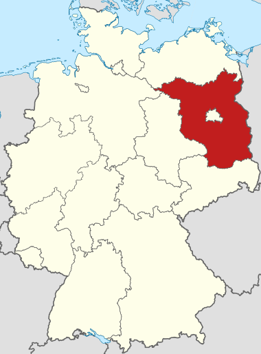
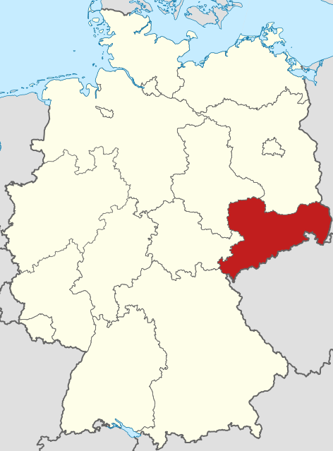
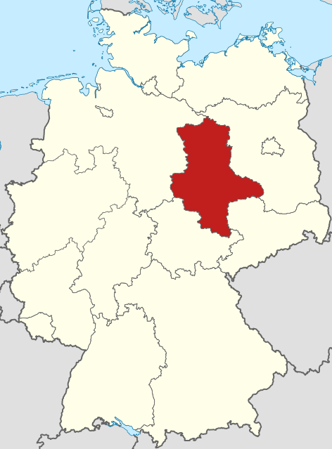
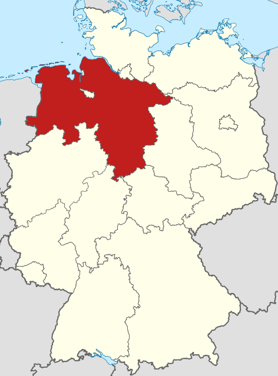
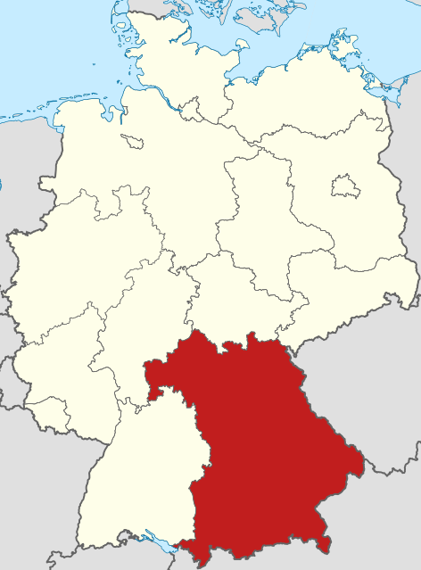
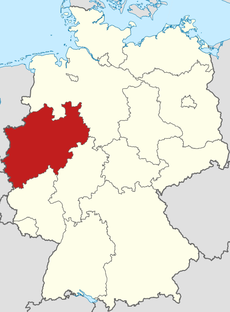
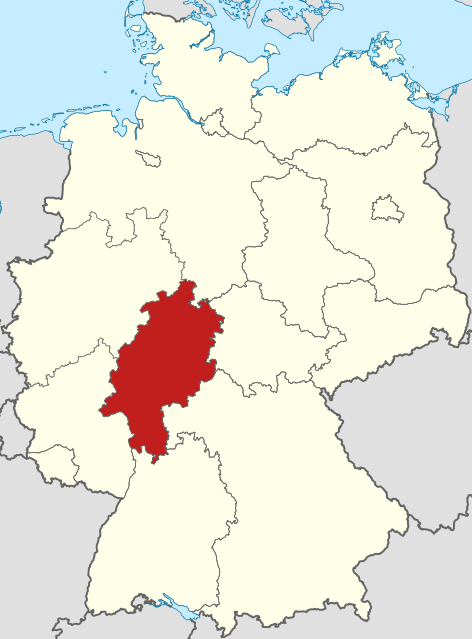

# ドイツの州名

デンマークの影響を受けたシュレースヴィヒ＝ホルシュタイン、ポーランドに関連するメクレンブルク＝フォアポンメルン、右側がブランデンブルク、そして右から左へ3つのザクセンを含む州、下の2つの大きな州バイエルンとバーデン＝ヴュルテンベルク、左側の2つのライン川に関連する州、中央のヘッセンとテューリンゲン。このように一周し、さらに3つの都市州ベルリン、ハンブルク、ブレーメンを加える。最後に、フランスに2度分割された南西部のザールランド。

最北端の州シュレースヴィヒ＝ホルシュタインは、意訳で「泥水湾-森の人」。この州は歴史的に2つの公国で構成されている。ちなみに、名前の中にハイフン（-）が含まれる場合、必ず2つの部分で構成されており、人名についても同様。シュレースヴィヒはデンマーク語の響きが強く、ホルシュタインのHolsはHolz（木）を指し、-teinは発音の偶然でStein「石」とは関係ない。

北東部のメクレンブルク＝フォアポンメルンは、意訳で「大城-前浜」。mecklenは英語のmuchと同源で「大きい」を意味し、地名にBurgが含まれる場合は「城」と関連がある。フォアポンメルンの先にはヒンターポンメルンがあり、ポーランド側にある。vorは「前」、merという印欧語の「海」を表す語根も明確に見て取れる。

ブランデンブルクは、意訳で「泥濘の城」。Brandenの語源には諸説あるが、古チェコ語の「泥濘」に由来するという説が最も信憑性が高い。

ザクセンは、意訳で「刀の部族」。本来の意味は刀で、ゲルマン部族の名称である。

ザクセン＝アンハルトは、意訳できない。アンハルトの語源は失われている。仮に「刀部-アンハルト」と呼ぶ。

ニーダーザクセンは、意訳「低地ザクセン」。

バイエルンは、意訳「牛の所有者」。ケルト語と関連があるため、語根が分かりにくい。

バーデン＝ヴュルテンベルクは、意訳「温泉-男山」。バーデンは「入浴」を意味し、バーデンと名の付く場所には温泉がある。ヴュルテムはケルト語の「男山」に由来し、後にドイツ語のBerg（山）が追加され、「天津港」のような重複表現となっている。

Rheinland-Pfalz、意訳「江原-行宮」。Rheinは「流れる」という意味で、PfalzはPalast（宮殿）と語源的な関係があります。

Nordrhein-Westfalen、意訳「北江-西平」。Falenは「平地」を指します。

Hessen、意訳不可。語源の意味はすでに不明です。古代の名称はCattiで、これは「全国翻訳資格試験」の英語略称CATTIと全く同じです。

Thüringen、意訳「強部」。本来の意味は「強い」で、ゲルマン部族の名称です。

Berlin、意訳「泥沼」、西スラブ語に由来します。ゲルマン語の観点からは、Bär+ling、つまり「子熊」のように聞こえるため、無理やり「子熊」と解釈されました。ベルリンの市の紋章は「熊」です。

Hamburg、意訳「腿堡」。Hamは曲がった足🦵を指し、川の曲がり角に位置します。英語のhamは「ハム」の意味です。川の曲がり角の城から、有名な食べ物がこの地名に由来しています。それがHamburger（ハンバーガー）です。食物と深い関わりを持つ地名です。

Bremen、意訳「延辺」。これは英語のbrim（縁）と語源的な関係があります。

Saarland、意訳「流原」。Saarは川の名前で、語源は「流れる水」です。