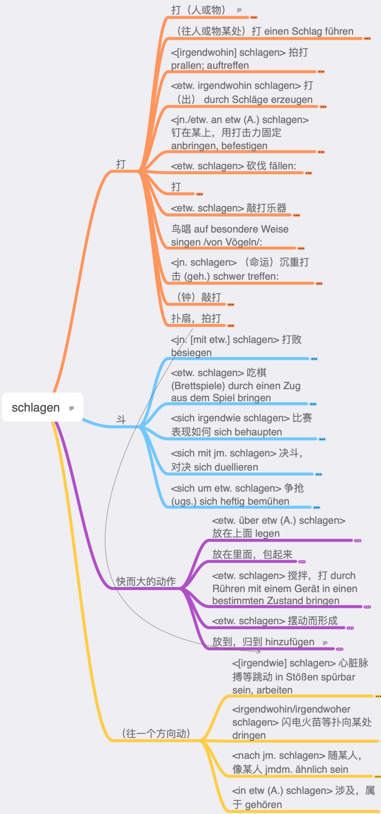

# 語彙

## 高頻度語

### 名詞

| Noun                  | Translation           | Example                                                      | Example translation                                          |
| --------------------- | --------------------- | ------------------------------------------------------------ | ------------------------------------------------------------ |
| das Jahr              | year                  | Das Jahr geht zu  Ende                                       | The year is  coming to an end                                |
| das Mal               | time                  | Helmut ist schon  zum zweiten Mal in Schweden                | Helmut is in  Sweden already for the second time             |
| das Beispiel          | example               | Ich könnte zum  Beispiel früher kommen                       | I could come  earlier, for example.                          |
| die Zeit              | time                  | Ich habe keine  Zeit                                         | I don't have  time                                           |
| die Frau              | woman, wife, Mrs      | Im Komitee waren  nur vier Frauen                            | There were only  4 women on the committee                    |
| der Mensch            | human being, man      | Stammt der  Mensch vom Affen ab?                             | Is human being  descended from apes?                         |
| das Kind              | child                 | Unser Kind geht  schon in den Kindergarten                   | Our child  already goes to kindergarten                      |
| der Tag               | day                   | Sonntag ist der  schönste Tag der Woche                      | Sunday is the  best day of the week                          |
| der Mann              | man                   | Siehst du den  Mann dort?                                    | Do you see that  man there?                                  |
| das Land              | land, country, state  | Dänemark ist ein  kleines Land in Europe                     | Denmark is a  small country in Europe                        |
| die Frage             | question              | Antworte mir  bitte auf meine Frage                          | Please answer my  question                                   |
| das Haus              | House                 | Mein Bruder baut  sich ein Haus                              | My brother's  building himself a house.                      |
| der Fall              | fall, case            | Ich habe so  einen Fall noch nicht erlebt                    | I've never seen  a case like this before.                    |
| die Leute             | people                | Viele Leute  beobachten den Unfall, aber keiner half         | A lot of people  were watching the accident, but nobody helped. |
| die Arbeit            | work                  | Es wartet viel  Arbeit auf uns                               | A lot of work  awaits us                                     |
| das Prozent           | percent               | Diese Prüfung  zählt zehn Prozent der Gesamtnote             | This exam counts  for ten percent of the overall grade.      |
| das Hand              | hand                  | Ich habe mir die  linke Hand gebrochen                       | I broke my left  hand                                        |
| die Stadt             | city, town            | Köln ist eine  Stadt in Deutschland                          | Cologne is a  city in Germany                                |
| der Teil              | part                  | Im ersten Teil  des Buches werden die Charakter vorgestellt  | The characters  are introduced in the first part of the book |
| das Problem           | problem               | Wir werden das  Problem lösen                                | We will solve  the problem                                   |
| die Welt              | world                 | Eine Reise um  die Welt is teuer                             | A trip around  the world is expensive                        |
| die Recht             | right, law            | Nach  europäischem Recht ist das verboten                    | According to  European law this is forbidden.                |
| das Ende              | end                   | Das Ende des  Films war traurig                              | The end of the  movie was sad                                |
| die Schule            | school                | Sie geht noch  zur Schule                                    | She still goes  to school                                    |
| die Woche             | week                  | In der nächsten  Woche sind Prüfungen                        | Next week, exams  are scheduled                              |
| der Vater             | father                | der Vater von  Andrea ist gerade vierzig geworden            | Andreas father  already turned 40                            |
| die Seite             | side, page            | Das Buch hat  zweihundert Seiten.                            | The book has 200  pages                                      |
| das Leben             | life                  | Sie versucht,  den Tieren das Leben zu retten                | She's trying to  save the lives of the animals.              |
| die Mutter            | mother                | Meine Mutter ist  Chefin eines Konzerns                      | My mother is the  head of a group of companies.              |
| der Grund             | reason, basis         | Du hast keinen  Grund, böse zu sein                          | You have no  reason to be angry.                             |
| das Auge              | eye                   | Max hat sehr  schöne Auge                                    | Max has very  beautiful eyes                                 |
| das Wort              | word                  | Ich habe das  letzte Word nicht verstanden                   | I didn't get the  last word                                  |
| der Geld              | money                 | Ich habe kein  Geld                                          | I don't have  money                                          |
| die Sache             | thing, matter         | Die Sache hat  sich erledigt                                 | The matter has  been settled.                                |
| die Art               | type, kind            | Löwe sind eine  Art Katzen                                   | Lions are a kind  of cats.                                   |
| der Bereich           | area, region          | In diesem  Bereich ist Frau Bitter expertin                  | Ms Bitter is an  expert in this area.                        |
| der Weg               | path, way             | Der Weg biegt  später nach links ab                          | The road turns  left later                                   |
| die Stunde            | Hour                  | Der Zug hatte  zwei Stunden Verspätung                       | The train ran 2  hours late                                  |
| der Name              | name                  | Mein Name is  Charlotte                                      | My name is  Charlotte                                        |
| die Geschichte        | history, story        | Abends liest die  Oma den Kindern Geschichten vor            | In the evening,  grandma reads stories to the children.      |
| die  Gesellschaft     | society, company      | Eine  multikulturelle Gesellschaft muss tolerant sein        | A multicultural  society must be tolerant                    |
| der Kopf              | head                  | Mir tut der Kopf  weh                                        | My head hurts                                                |
| das Paar              | pair, couple          | Agnes hat zwei  Paar schöne Schuhe gekauft                   | Agnes bought two  pairs of beautiful shoes                   |
| die  Möglichkeit      | possibility           | Nach der  Konferenz haben Sie die Möglichkeit, essen zu gehen | After the  conference, you will have the opportunity to eat out |
| das  Unternehmen      | enterprise, company   | Das Unternehmen  ging in Konkurs                             | The company went  bankrupt.                                  |
| das Bild              | picture               | Renates Büro  hängt voller Bilder                            | Renate's office  is full of pictures.                        |
| das Buch              | book                  | Friedrich hat  das Buch schon zweimal gelesen                | Friedrich has  read this book already two times              |
| das Wasser            | water                 | Das Wasser ist  zu kalt zum Baden                            | The water is too  cold for swimming                          |
| die Stelle            | place                 | Wir treffen uns  an der gleichen Stelle wie letzte Woche     | We'll meet at  the same place as last week.                  |
| der Form              | form, shape           | Das Lindenblatt  hat die Form eines Herzens                  | The lime leaf  has the shape of a heart                      |
| die  Entwicklung      | development           | Die Firma hat  eine eigene Abteilung für Forschung und Entwicklung | The company has  its own department for research and development. |
| der Monat             | month                 | Mit sechs  Monaten bekommen Babys die ersten Zähne           | Babies get their  first teeth when they're six months old    |
| die Familie           | family                | Die ganze  Familie wohnt in einem Dorf zusammen              | The whole family  lives together in one village.             |
| der Morgen            | morning               | Am Morgen  scheint die Sonne ins Schlafzimmer                | In the morning  the sun shines into the bedroom              |
| der Abend             | evening               | Im Winter wird  es Abends früh dunkel                        | In winter it  gets dark early in the evening                 |
| die Aufgabe           | task, assignment, job | Lösen Sie bitte  die folgenden Aufgaben                      | Please solve the  following tasks                            |
| die  Universität, Uni | university            | Die Universität  wird 60 jahre alt                           | University turns  60 years old                               |
| der Sinn              | sense, meaning        | Mann soll das  Leben mit allen Sinnen genießen               | Man shall enjoy  life with all his senses                    |
| der Staat             | state                 | Die Steuern  bekommt der Staat                               | The state gets  the taxes                                    |
| das Ziel              | destination, goal     | Hamburg war das  Ziel seiner Reise                           | Hamburg was the  destination of his journey                  |
| der Freund            | friend, boyfriend     | Franziska wohnt  mit ihrem Freund zusammen                   | Franziska lives  with her boyfriend                          |
| das Thema             | subject, topic, theme | Ich würde gern  das Thema wechseln                           | I'd like to  change the subject.                             |
| die Person            | person                | Dieser Tisch ist  ab 20 Uhr für acht Personen reserviert     | This table is  reserved from 20 o'clock for eight persons.   |
| die Nacht             | night                 | Sie haben die  ganze Nacht getanzt                           | They've been  dancing all night.                             |
| der Ding              | thing                 | Gib mr mal das  Ding da!                                     | Give me that  thing!                                         |
| der Raum              | room, space           | Das Wohnzimmer  ist der größte Raum in der Wohnung           | The living room  is the largest room in the apartment        |
| der Blick             | view, look, glance    | Von der  Turmspitze hat man einen schönen Blick über die ganze Stadt | From the top of  the tower you have a beautiful view over the whole city. |
| der Platz             | place, room, square   | Ich habe nicht  genug Platz                                  | I don't have  enough room                                    |
| die Zahl              | number                | Eine große Zahl  von Jugendlichen raucht                     | A large number  of young people smoke                        |
| das System            | system                | Neben der  Demokratie gibt es noch andere politische Systeme | There are other  political systems besides democracy         |
| die Uhr               | hour, watch           | Es ist genau  zehn Uhr                                       | It's ten o'clock  exactly.                                   |
| die Eltern            | parents               | In den Ferien  fahren wir mit den Eltern an die Ostsee       | During the  holidays we will go with our parents to the Baltic Sea |
| die Straße            | street                | Die Straße wird  neu gebaut                                  | The road is  newly built                                     |
| die Minute            | minute                | Der Kuchen muss  zwanzig Minuten backen                      | The cake must  bake for twenty minutes.                      |
| die Gruppe            | group                 | Zu den Workshops  treffen wir uns in kleinen Gruppen         | For the  workshops we gather in small groups                 |
| das Wert              | value                 | Die Aktie hat an  Wert verloren                              | The share price  has lost value                              |
| die Gesicht           | face                  | Sie hat ein  rundes, immer freundliches Gesicht              | She has a round,  always friendly face.                      |
| die Sprache           | language              | Die deutsche  Sprache hat den Ruf, schwierig zu sein         | The German  language has the reputation of being difficult.  |
| der Anfang            | beginning             | Am Anfang war  das Wort                                      | In the beginning  was the word                               |
| der Ort               | place, town, location | Bad Harzburg ist  ein kleiner Ort im Harz                    | Bad Harzburg is  a small town in the Harz Mountains          |
| der Moment            | moment                | Warte noch einen  Moment!                                    | Wait a minute!                                               |
| die Folge             | result, consequence   | Die Folge davon  war, dass er arbeitslos wurde               | The result was  that he lost his job                         |
| das Interesse         | interest              | Sind  Studiengebühren im Interesse der Studenten?            | Are tuition fees  in the interest of students?               |
| die Rolle             | role, roll            | Gustav Gründgens  überzeugte in der Rolle des Faust          | Gustav Gründgens  was convinced in the role of Faust         |
| die Tür               | door                  | Sein Name steht  an die Tür                                  | His name is on  the door.                                    |
| der Schüler           | student               | Alle Schüler  treffen sich donnerstags in der Aula           | All students  meet in the auditorium on Thursdays.           |
| die Bedeutung         | meaning, significance | Was hat das für  eine Bedeutung?                             | What does that  mean?                                        |
| der Text              | text                  | Der Text ist zu  Lang                                        | The text is too  long                                        |
| das Ergebnis          | result, outcome       | Die  Projektgruppe stellt ihre Ergebnisse vor                | The project  group presents its results                      |
| der Krieg             | war                   | Die Soldaten  ziehen in den Krieg                            | The soldiers go  to war                                      |
| die Weise             | way, manner           | Auf welche Weise  lösen wir das Problem am schnellsten?      | What is the  quickest way to solve the problem?              |
| die Regierung         | rule, government      | Die Regierung  sitzt in Berlin                               | The government  is in Berlin                                 |
| der Stück             | piece                 | Ich möchte noch  ein Stück Kuchen                            | I'd like another  piece of cake.                             |
| die Wohnung           | apartment, flat       | Die Wohnung ist  im dritten Stock                            | The apartment is  on the third floor                         |
| das Gespräch          | conversation          | Ein vernünftiges  Gespräch war nichts mehr möglich           | A reasonable  conversation was no longer possible            |

### 動詞

| Verb                | Translation                    | Example                                                      | Example translation                                          |
| ------------------- | ------------------------------ | ------------------------------------------------------------ | ------------------------------------------------------------ |
| sagen               | to say                         | Conny sagt ihrem  Man die Wahrheit                           | Conny tells her  husband the truth                           |
| machen              | to make                        | Ich mache meine  Hausaufgaben                                | I am doing my  homework                                      |
| geben               | to give                        | Ich gebe dir das  Buch                                       | I am giving you  the book                                    |
| kommen              | to come                        | Wir kommen  morgen zu dir                                    | We will come to  you tomorrow                                |
| gehen               | to go                          | Wir gehen ins  Kino                                          | We are going to  the movies                                  |
| wissen              | to know                        | Woher weißt du  das?                                         | Where do you  know this from?                                |
| sehen               | to see                         | Mark sieht ohne  Brille nichts                               | Mark sees  nothing without his glasses                       |
| stehen              | to stand,                      | Der Maler steht  auf dem Balkon                              | The painter  stands on the balcony                           |
| finden              | to find                        | Wir finden keine  Lösung                                     | We are failing  to find a solution                           |
| bleiben             | to stay, remain                | Du kannst bis  morgen bleiben                                | You can stay  till tomorrow                                  |
| liegen              | to lie                         | Der Kranke liegt  im Bett                                    | The patient lies  in bed                                     |
| heißen              | to be called                   | Sie heißt Anja                                               | Her name is Anja                                             |
| denken              | to think                       | Wir denken an  dich                                          | We think of you                                              |
| nehmen              | to take                        | Kannst du den  Koffern nehmen?                               | Can you take the  suitcase?                                  |
| tun                 | to do                          | Wir tun nur  unsere Pflicht                                  | We're just doing  our duty                                   |
| glauben             | to believe                     | Glaubst du uns?                                              | Do you believe  us?                                          |
| halten              | to hold                        | Er hält eine  Blume in der Hand                              | He is holding a  flower in his hand                          |
| nennen              | to name, call                  | Sie nennen ihren  Sohn Max                                   | They will call  their son Max                                |
| mögen               | to like                        | Ich mag Äpfel                                                | I like apples                                                |
| zeigen              | to show                        | Der Stadtführer  zeigt den Touristen die Stadt               | The city guide  shows the tourists the city                  |
| führen              | to lead                        | Die Straße führt  ins nächste Dorf                           | The road leads  to the next village                          |
| sprechen            | to speak                       | Ich spreche mit  dir                                         | I am speaking  with you                                      |
| bringen             | to bring                       | Er bringt seiner  Freundin Blumen                            | He is bringing  flower to his girlfriend                     |
| leben               | to live                        | Tobi lebt in  Berlin                                         | Tobi lives in  Berlin                                        |
| fahren              | to drive, ride, go             | Jan fahrt gern  Fahrrad                                      | Jan likes to  ride a bike                                    |
| meinen              | to think, have an opinion      | Was meint ihr zu  dieser Idee?                               | What do you  think about this idea?                          |
| fragen              | to ask                         | Max hat nach dir  gefragt                                    | Max asked for  you                                           |
| gelten              | to be valid                    | Dieser Fahrplan  gilt nicht mehr                             | This timetable  is no longer valid                           |
| stellen             | to place, set                  | Ich stelle den  Teller auf den Tisch                         | I am putting a  plat on the table                            |
| spielen             | to play                        | Die Kinder  spielen draußen                                  | The children are  playing outside                            |
| arbeiten            | to work                        | Er arbeitet seit  zwei Jahren in dieser Firma                | He has been  working in this company for two years           |
| brauchen            | to need                        | Brauchst du  Hilfe?                                          | Do you need  help?                                           |
| folgen              | to follow                      | Ich folge deinem  Rat                                        | I follow your  advice                                        |
| lernen              | to learn                       | Sie lernt  Deutsch                                           | She is learning  German                                      |
| bestehen            | to exist                       | Die Firma  besteht seit 2004                                 | The company  exists since 2004                               |
| verstehen           | to understand                  | Jan versteht  kein Englisch                                  | Jan does not  understand any English                         |
| setzen              | to set, place, put             | Wenn man die  Daten zueinander in die Beziehung setzt, kommt man zu interessanten  Ergebnissen | If you connect  the data together, you get interesting results. |
| bekommen            | to get, receive                | Wir bekomme  selten Post                                     | We rarely get  mail                                          |
| beginnen            | to begin                       | Max beginnt im  Herbst sein Studium                          | Max begins his  studies in autumn                            |
| erzählen            | to tell                        | Die Mutter  erzählt ihren Kindern ein Märchen                | The mother tells  her children a fairytale                   |
| versuchen           | to try, attempt                | Ich versuche,  die Prüfung dieses Mal zu bestehen            | I will try to  pass this exam this time.                     |
| schreiben           | to write                       | Romeo schreibt  Julia einen Liebesbrief                      | Romeo is writing  a love letter to Juliet                    |
| laufen              | to run                         | Erwin läuft  jeden Tag fünf Runden im Park                   | Erwin runs five  laps in the park every day                  |
| erklären            | to explain                     | Der Lehrer  erklärt seinen Schülern eine chemische Formel    | The teacher  explains a chemical formula to the students     |
| entsprechen         | to correspond, match           | Der Anzug  entspricht nicht meinen Vorstellungen             | The suit doesn't  match my expectation.                      |
| sitzen              | to sit                         | Auf dem Sofa  sitzt der Kater und putzt sich                 | The cat sits on  the sofa and cleans itself                  |
| ziehen              | to pull, move                  | Man muss an der  Tür ziehen, um sie zu öffnen                | You must pull  the door to open it                           |
| scheinen            | to shine, seem, appear         | der Sonne  scheint                                           | The sun is  shining                                          |
| fallen              | to fall                        | Lass die Vase  bitte nicht fallen!                           | Please don't let  the vase fall!                             |
| gehören             | to belong                      | der Koffer  gehört mir                                       | The suitcase  belongs to me                                  |
| entstehen           | to originate, develop          | Wirbelstürme  entstehen über dem Meer                        | Hurricanes form  over the sea                                |
| erhalten            | to receive                     | Den Brief habe  ich am Mittwoch erhalten                     | I received the  letter on Wednesday                          |
| treffen             | to meet                        | Wir treffen uns  morgen Mittag auf dem Markt                 | We will meet  each other tomorrow noon at the market.        |
| suchen              | to search, look for            | Ich habe meinen  Sonnenbrille stundenlang gesucht            | I have searched  for my sunglasses for hours                 |
| legen               | to lay, put                    | Die Mutter legt  das Baby ins Bett                           | The mother puts  the baby on the bed                         |
| vorstellen          | to introduce, imagine          | Der Manager  stellt das neue Konzept vor                     | The manage is  introducing the new concept                   |
| handeln             | to deal, trade, be about       | Der Roman  handelt von einer modernen Familie                | The novel is  about a modern family                          |
| erreichen           | to achieve, reach              | Nach vier  Stunden erreichten wir den Berggipfel             | After four hours  we reached the mountaintop                 |
| tragen              | to carry, wear                 | Sie trägt im  Sommer gern Kleider                            | She likes to  wear dresses in summer.                        |
| schaffen            | to manage, create              | Ich schaffe  meine Arbeit nicht                              | I'm not managing  to do my job                               |
| lesen               | to read                        | Antina liest  gern Game of Thrones Bücher                    | Antina likes to  read Game of Thrones books                  |
| verlieren           | to lose                        | Die Kirche  verliert an Einfluss                             | The church is  losing its influence                          |
| darstellen          | to depict, portray             | Das Bild stellt  eine Winterlandschaft dar.                  | The image  depicts a winter landscape                        |
| erkennen            | to recognize, admit            | Ich kann es  nicht erkennen, ich sehe schlecht               | I cannot quite  see it, I have a poor eyesight               |
| entwickeln          | to develop                     | Schmetterlinge  entwickeln sich aus Raupen                   | Butterflies  develop from caterpillars                       |
| reden               | to talk                        | Ich möchte jetzt  nicht darüber reden                        | I don't want to  talk about it now                           |
| aussehen            | to appear, look                | Sie sieht aus  wie ihre Großmutter                           | She looks like  her grandmother                              |
| erscheinen          | to appear                      | Die ersten  Sterne erscheinen am Himmel                      | The first stars  are appearing in the sky                    |
| bilden              | to form, educate               | Den Höhepunkt  des Festes bildet das abendliche Feuerwerk    | The highlight of  the festival is the evening fireworks show |
| anfangen            | to begin                       | Das Theaterstück  fängt gleich an                            | The play's about  to start                                   |
| erwarten            | to expect                      | Unser Chef  erwartet großes Engagement von seinen Mitarbeitern | Our boss expects  great commitment from his employees        |
| wohnen              | to live                        | Mark wohnt schon  dreizehn Jahre in Deutschland              | Mark has been  living in Germany already for 14 years        |
| betreffen           | to affect, concern             | Das betrifft  alle Abiturienten dieses Jahrgangs             | That concerns  all high school graduates of this year's class |
| warten              | to wait                        | Die Kinder  warten voller Ungeduld auf Weihnachten           | The children are  waiting impatiently for Christmas.         |
| vergehen            | to pass (about time)           | Wie die Zeit  vergeht.                                       | How the time  flies.                                         |
| helfen              | to help                        | Kinder sollten  im Haushalt helfen                           | Children should  help with the household                     |
| gewinnen            | to win, gain                   | Sie möchte eine  Medaille gewinnen                           | She wants to win  a medal                                    |
| schließen           | to close                       | Schließen Sie  jetzt bitte die Augen                         | Please close  your eyes                                      |
| fühlen              | to feel                        | Sie fühlt sich  schlecht                                     | She is not  feeling well                                     |
| bieten              | to offer                       | Nach dem Vortrag  bietet sich die Gelegenheit zu einem Stadtrundgang | After the  lecture you will have the opportunity to take a tour of the city. |
| interessieren       | to interest                    | Das fünfte  Kapitel interessiert uns heute besonders         | The fifth  chapter is especially interesting for us today    |
| interessieren  sich | to be interested               | Hans  interessiert sich für Architektur                      | Hans is  interested in Architecture                          |
| erinnern            | to remind                      | Ich werde dich  daran erinnern                               | I will remind  you about it                                  |
| erinnern sich       | to remember                    | Ich kann mich  nicht daran erinnern                          | I cannot  remember it                                        |
| ergeben             | to result in                   | Vier plus vier  ergibt acht                                  | 4 plus 4 equals  8                                           |
| anbieten            | to offer                       | Die Firma bietet  einen rabatt von 10% an                    | The company is  offering a 10% discount                      |
| studieren           | to study                       | Nach ihrem  Abitur will Melanie Psychologie studieren        | After her  graduation, Melanie wants to study psychology     |
| verbinden           | to connect, link               | Verbinden Sie  ihre Smartwatch mit dem Handy                 | Connect your  smartwatch to your mobile phone                |
| ansehen             | to look at, watch              | Ich sehe mir  gleich die Nachrichten an                      | I'm about to  watch the news.                                |
| fehlen              | to lack, be missing, be absent | Es fehlt die  Unterschrift                                   | The signature is  missing                                    |
| bedeuten            | to mean                        | Was bedeutet  das?                                           | What does that  mean?                                        |
| vergleichen         | to compare                     | Vergleich doch  mal die Preise                               | Please compare  the prices one more time                     |
| steigen             | to climb, increase             | Die Aktien  steigen                                          | The stocks are  rising                                       |
| verlassen           | to leave                       | Wir verlassen  das Haus um 8 Uhr                             | We will leave  the house at 8                                |
| verlassen sich      | To depend, rely on             | Ich verlasse  mich auf dich                                  | I rely on you                                                |

### 形容詞

| Adjective        | Translation            | Example                                                      | Example translation                                          |
| ---------------- | ---------------------- | ------------------------------------------------------------ | ------------------------------------------------------------ |
| ganz             | whole, entire          | Ich habe eine  ganze Pizza gegessen                          | I ate an entire  pizza                                       |
| groß             | big, large             | Berlin ist eine  große Stadt                                 | Berlin is a big  city                                        |
| gut              | good                   | Das Eis schmeckt  gut                                        | The ice cream  tastes good                                   |
| neu              | new                    | Ruben braucht  neue Schuhe                                   | Ruben needs new  shoes                                       |
| erste            | first                  | Der erste Zug  fährt um sechs Uhr ab                         | The first train  leaves at six o'clock                       |
| lang             | long                   | Heute war ein  langer Tag                                    | Today was a long  day                                        |
| klein            | small, little          | Ein kleines Auto  passt in jede Parklücke                    | A small car fits  into every parking space                   |
| alt              | old                    | Neben dem Haus  steht ein alter Baum                         | Next to the  house is an old tree                            |
| hoch             | high, tall             | Der Brocken ist  ein hoher Berg                              | The Brocken is a  high mountain                              |
| einfach          | simple, easy           | Pudding kochen  ist eine einfache Aufgabe                    | Pudding cooking  is a simple task                            |
| letzte           | last                   | Pauline kam als  letzte ins Ziel                             | Pauline was the  last one to finish                          |
| gleich           | same                   | Da haben die  Eltern die gleiche Meinung                     | The parents have  the same opinion                           |
| möglich          | possible               | Ist es möglich,  später zu bezahlen?                         | Is it possible  to pay later?                                |
| eigen            | own                    | Auch Kinder  dürfen ihre eigene Meinung haben                | Even children  can have their own opinion                    |
| schön            | beautiful              | Ein Buch ist ein  schönes Geschenk                           | A book is a  beautiful gift                                  |
| spät             | late                   | Es ist schon  spät                                           | It's getting  late                                           |
| wichtig          | important              | Eine wichtige  Besprechung fällt heute aus                   | An important  meeting has been cancelled today               |
| weitere          | additional, further    | Gibt es noch  weitere Fragen?                                | Are there any  further questions?                            |
| genau            | exactly                | Wie spät ist es  genau?                                      | What time is it  exactly?                                    |
| jung             | young                  | Da stand ein  junger Mann vor der Tür                        | There was a  young man at the door                           |
| kurz             | short                  | Isabel hat kurze  Haare                                      | Isabel has short  hair                                       |
| stark            | strong                 | Angela ist eine  starke Frau                                 | Angela is a  strong woman                                    |
| richtig          | correct                | Das richtige  Antwort wusste niemand                         | Nobody knew the  right answer                                |
| verschieden      | different, diverse     | Ihre Töchter  sind sehr verschieden                          | Her daughters  are very different                            |
| bestimmt         | specific, certain      | Ich suche ein  bestimmtes Buch                               | I'm looking for  a certain book                              |
| besser           | better                 | Sie kann besser  schwimmen als wir                           | She can swim  better than we can                             |
| schnell          | fast                   | Ein schnelles  Auto verbraucht auch meist viel Benzin        | A fast car also  usually uses a lot of petrol                |
| sicher           | safe, secure           | Diese Methode  ist absolut sicher                            | This method is  absolutely safe                              |
| nächste          | next                   | Nächste Woche  ist Ostern                                    | Next week is  Easter                                         |
| politisch        | political              | Markus ist  politisch sehr aktiv                             | Markus is  politically very active                           |
| klar             | clear                  | Boris hat klare  Vorstellungen von seinem Traumberuf         | Boris clearly  knows what his dream job is                   |
| schwer           | difficult, heavy       | Esel können  schwere Lasten tragen                           | Donkeys can  carry heavy loads                               |
| einzeln          | individual             | Die  Geburtstagsgäste kamen alle einzeln                     | The birthday  guests all came one at a time                  |
| bekannt          | well-known             | Heike Makatsch  ist eine bekannte deutsche Schauspielerin    | Heike Makatsch  is a well-known German actress               |
| leicht           | light, easy            | Kinder erziehen  ist keine leichte Aufgabe                   | Raising children  is not an easy task                        |
| rund             | round                  | Das Rad ist  nicht mehr hanz rund                            | The wheel is not  round any more                             |
| frei             | free                   | Der Platz neben  mir ist noch frei                           | The place next  to me is still free                          |
| früh             | early                  | Sechs Uhr  morgens? Das ist aber sehr früh!                  | Six o'clock in  the morning? That's very early!              |
| unterschiedlich  | different, variable    | Zum Bahnhof  gelangt man mit unterschiedlichen Verkehrsmitteln | The train  station can be reached by various means of transport |
| schlecht         | bad                    | Die Menschen  sind schlecht, alle denken nur an sich         | People are bad,  everyone thinks only about themselves       |
| deutlich         | clear                  | Kristin hat eine  deutliche Aussprache                       | Kristin has a  clear pronunciation                           |
| allgemein        | general                | Es ist allgemein  bekannt, dass Paris in Frankreich liegt    | It's well known  that Paris is France                        |
| einzig           | only, single           | Gina ist das  einzige Mädchen in der Klass                   | Gina is the only  girl in the class                          |
| gemeinsam        | common, mutual         | Ein gemeinsamer  Feind stärkt die Gruppe                     | A common enemy  strengthens the group                        |
| nahe, nah        | near, close            | Weihnachten  rückt immer näher                               | Christmas is  getting closer and closer                      |
| voll             | full                   | Die Flasche ist  noch ganz voll                              | The bottle is  still quite full                              |
| direkt           | direct, straight       | Wir gehen auf  direktem Weg nach Hause                       | We're going  straight home                                   |
| international    | international          | Die Universität  hat einen internationalen Anspruch          | The university  has an international claim                   |
| sozial           | social                 | Bei  Spendenaktionen wird gern an das soziale Gewissen der Spender appelliert | In fundraising  campaigns, the social conscience of the donor is often appealed to |
| beste (r,s)      | best                   | Meine Mutter  macht den besten Currywurst der Welt           | My mother makes  the best currywurst in the world            |
| rot              | red                    | Rote Socken  passen nicht zu blauen Schuhen                  | Red socks do not  match blue shoes                           |
| offen            | open                   | Die Flasche ist  schon offen                                 | The bottle is  already open                                  |
| meiste           | most                   | Am meisten hat  mir Richard gefallen                         | I liked Richard  the most                                    |
| besondere  (r,s) | special                | Barbara ist eine  ganz besondere Frau                        | Barbara is a  very special woman                             |
| öffentlich       | public                 | Die Sitzung der  Parlaments ist öffentlich                   | The sitting of  Parliament shall be open to the public       |
| halb             | half                   | Wir gehen halb  eins essen                                   | We're going to  eat half past 12                             |
| wahrscheinlich   | porbably               | Es wird  wahrscheinlich eine Stunde dauern                   | It'll probably  take an hour                                 |
| wesentlich       | essential, fundamental | Das ist ein ganz  wesentlicher Unterschied                   | That is a very  important difference                         |
| ähnlich          | similar                | Max sieht seinem  Bruder ähnlich                             | Max looks like  his brother                                  |
| häufig           | frequent               | Hier werden  häufige Wörter gesammelt                        | Common words are  collected here                             |
| schwarz          | black                  | Dort stand es  schwarz auf weiß                              | There it was in  black and white                             |
| völlig           | complete               | Das ist völlig  Überflüssig                                  | It's completely  unnecessary                                 |
| gering           | low, small             | Das ist ein  geringes Problem                                | It's a minor  problem                                        |
| schwierig        | difficult              | Bowling ist  schwieriger, als ich dachte                     | Bowling's harder  than I thought                             |
| praktisch        | practical              | Ich finde kein  praktisches Beispiel                         | I can't find a  practical example                            |
| personlich       | personal               | Ich persönlich  fand den Film gar nicht so schlecht          | Personally, I  didn't think the movie was so bad             |
| modern           | modern                 | Moderne Autos  haben Airbags serienmäßig                     | Modern cars have  airbags as standard                        |
| tief             | deep                   | DasBaby schläft  so tief, dass es nichts hört                | The baby sleeps  so soundly that it hears nothing            |
| tatsächlich      | real, actual           | Er hat doch  tatsächlich geheiratet!                         | He actually got  married!                                    |
| zusätzlich       | additional             | Zusätzlich zu  seinem Studium absolvierte er noch drei freiwillige Praktika | In addition to  his studies, he completed three voluntary internships |
| wirtschaftlich   | economic, financial    | China hat viele  wirtschaftliche Probleme                    | China has many  economic problems                            |
| interessant      | interesting            | Interessante  Diplomarbeiten sind selten                     | Interesting  diploma theses are rare                         |
| relativ          | relative               | Meine Wohnung  ist relativ klein                             | My apartment is  relatively small                            |
| gleichzeitig     | simultaneous           | Sie sprangen  gleichzeitig von der Brücke                    | They jumped off  the bridge at the same time                 |
| grün             | green                  | Die Bäume werden  grün                                       | The trees turn  green                                        |
| weiß             | white                  | Schneewittchens  Haut war weiß wie Schnee                    | Snow White's  skin was white as snow                         |
| gesamt           | whole, entire          | Die gesamte  Universität musste evakuiert werden             | The entire  university had to be evacuated                   |
| speziell         | special, specific      | Das ist eine  sehr spezielle Frage                           | That's a very  specific question                             |
| entscheidend     | decisive               | Der  entscheidende Vorteil für Investition lag in den Steuervergünstigung | The decisive  advantage of investment lay in the tax concession |
| eng              | narrow, close          | Er ist ein enger  Verwandter                                 | He's a close  relative                                       |
| technisch        | technical              | Das ist ein  technisches Problem                             | It's a technical  problem                                    |
| langsam          | slow                   | Faultiere  bewegen sich sehr langsam                         | Sloths move very  slowly                                     |
| ständig          | constant               | Ich denke  ständig an dich                                   | I'm always  thinking about you                               |
| notwendig        | necessary              | Das ist jetzt  nicht mehr notwendig                          | This is no  longer necessary                                 |
| rein             | pure, clean            | Das ist ja  reines Wasser!                                   | That's pure  water!                                          |
| wissenschaftlich | scientific, scholarly  | Wissenschaftliche  Aufsätze sind oft schwer zu lesen         | Scientific  essays are often difficult to read               |
| falsch           | false, wrong           | Ich habe eine  falsche Adresse angegeben                     | I gave a wrong  address                                      |
| fremd            | foreign                | Ich will eine  fremde Sprache lernen                         | I want to learn  a foreign language                          |
| selten           | rare                   | Jens schaut  selten fern                                     | Jens rarely  watches TV                                      |
| normal           | normal                 | Heute ist ein  ganz normaler Tag                             | It's just a  normal day today                                |
| wahr             | true                   | Das kann doch  nicht wahr sein                               | This can't be  true                                          |
| privat           | private                | Das ist meine  private E-Mail Adresse                        | That's my  private e-mail address                            |
| tot              | dead                   | Wagner ist seit  121 Jahren tot                              | Wagner has been  dead for 121 years                          |

## 語族

* 急いでいません。

  * 急がば回れ
  * 彼女は階段を駆け上がった。
  * 幸せな結婚生活を送る

* 永遠の
  * 永遠
  * ずっと、昔からずっと

* 拘留（こうりゅう）；監禁（かんきん）、港（みなと）

  * 逮捕（たいほ）する、留め付ける（針/画鋲で留める、糸やステープルで綴じる）、責任（せきにん）、ノート、激しい [hɛf**d**iç]（はげしい）

* 持ち上げる（もちあげる）、レバー、ジャッキ、創始者（そうししゃ）；著者（ちょしゃ）、酵母（こうぼ）、助産師（じょさんし）

  * 高く上げる（たかくあげる）；格上げする（かくあげする）はhebenの文語的表現、aufhebenは元々単純なドイツ語で「拾う；持ち上げる；保存する」を意味し、「保存」は通常「棚上げする」ことから「使用中止、廃止」の意味も生まれた。

* 理解する（りかいする）、容量（ようりょう）、カプセル、箱（はこ）、レジ

  * 概念（がいねん）、概念（がいねん）、構想過程（こうそうかてい）、構想する（こうそうする）

* 故郷（こきょう）

  * 不幸（ふこう）、苦痛（くつう）

  * 結婚（けっこん）

  * 地元（じもと）の、秘密（ひみつ）の、こっそりした（こっそりした）、不気味な（ぶきみな）、気味悪い（きみわるい）、怪物（かいぶつ）

  * 陰険な（いんけんな）、悪意のある（あくいのある）、悪意（あくい）

  * 帰宅する（きたくする）は「家に帰る」の意味もあるが、婉曲的に「死ぬ」を表すこともある。

    襲う（おそう）は「災いが訪れる」の意味で、特に災害のニュースでよく使われる：地震がその地域を襲った。

    仕返しする（しかえしする）は「報復」の意味で、「払い戻す」ようなニュアンス。彼の卑劣さには仕返ししてやる。

* 愛する（あいする）
  * 許可する（きょかする）、休暇（きゅうか）、留まる（とどまる）
  * 信じる（しんじる）、信仰（しんこう）
  * 許可（きょか）はmit Verlaubでしか使われない便利な表現で、「失礼ながら」と訳せる。例：これは、失礼ながら、あまりにも厚かましい。
  * 許可（きょか）は元々die Genehmigung（許可）と関連付けられていたため女性名詞
  * 債権者（さいけんしゃ）、公証する（こうしょうする）
  * 褒める（ほめる）、婚約する（こんやくする）、誓う（ちかう）
  * 愛らしい（あいらしい）または愛想の良い（あいそうのよい）
  * 最愛の人（さいあいのひと）はsich verlieben（恋に落ちる）ことができる
* 道（みち）

  * 離れて（はなれて）、～のため（～のため）
  * 道路（どうろ）、小道（こみち）、路地（ろじ）、行き止まり（いきどまり）
  * ルート、ルーター、ルーティン
  * 踏む（ふむ）、慣れた道から外れる（なれたみちからはずれる）
* 恐れる（おそれる）

  * 臆病な（おくびょうな）、内気な（うちきな）
  * 臆病（おくびょう）、嫌悪（けんお）、嫌な（いやな）、ひどい（ひどい）
  * 追い払う（おいはらう）、追い散らす（おいちらす）
* 喉の渇き（のどのかわき）

  * 干ばつ（かんばつ）；干害（かんがい）、乾いた（かわいた）
  * 干からびる（ひからびる）、乾燥させる（かんそうさせる）
  * テラス、領土（りょうど）
  * 1階（いっかい）；（劇場などの）平土間（ひらどま）
  * テラコッタ、トースト
* 博士（はかせ）

  * 教義（きょうぎ）、教条的な（きょうじょうてきな）、「教条的な」はより一般的にdogmatisch（教条的な）、教条主義（きょうじょうしゅぎ）
  * 文書（ぶんしょ）
  * 講義する（こうぎする）；講義調で話す（こうぎちょうではなす）、彼は教育について講義するのが好きだ。
  * 上品な（じょうひんな）
  * 正統派（せいとうは）；正教会（せいきょうかい）、逆説的（ぎゃくせつてき）の名詞は逆説（ぎゃくせつ）でpara（反）とdox-（観念、見方）の合成。
* walt, val 強

  * 両価的（りょうかてき）、等価（とうか）
  * 弁護士（べんごし）は一般にRechtsanwalt（弁護士）とStaatsanwalt（検察官）に分かれる
  * 暴力（ぼうりょく）は「強」から派生し、強大な（きょうだいな）；巨大な（きょだいな）、克服する（こくふくする）、圧倒する（あっとうする）、強姦する（ごうかんする）
  * 管理する（かんりする）、管理部門（かんりぶもん）
* 破門（はもん）、魅力（みりょく）

  * 破門する（はもんする）；魅了する（みりょうする）；悪霊を払う（あくりょうをはらう）、追放する（ついほうする）
  * 盗賊（とうぞく）
* 寓話（ぐうわ）

  * 子供っぽい（こどもっぽい）；天真爛漫（てんしんらんまん）、歩兵（ほへい）
  * 致命的（ちめいてき）；悲惨な（ひさんな）
  * 宗派（しゅうは）、教授（きょうじゅ）
* 流れる（ながれる）

  * 川（かわ）、液体（えきたい）、液体（えきたい）、洪水（こうずい）
  * 浮遊物（ふゆうぶつ、adj. 軽快な（けいかいな））、艦隊（かんたい）、筏（いかだ）、鰭（ひれ）
  * 飛ぶ（とぶ）、飛行（ひこう）、逃げる（にげる）、羽ばたく（はばたく）；気まぐれ（きまぐれ）；スリップする
* 試験（しけん）

  * 検査する（けんさする）、試験する（しけんする）
  * 試み（こころみ）；見本（みほん）、試運転（しうんてん）、試用期間（しようきかん）、血液検査（けつえきけんさ）
  * リハーサルする、試す（ためす）；味見する（あじみする）、被験者（ひけんしゃ）
* schn（口鼻部）

  * いびきをかく（いびきをかく）
  * 風邪（かぜ）、嗅ぐ（かぐ）
  * 息切れする（いきぎれする）、呼吸（こきゅう）、鼻をかむ（はなをかむ）
  * ねだる（ねだる）
  * 口ひげ（くちひげ）、ろうそくの燃えかす（ろうそくのもえかす）
* 喉（のど）

  * 喉（のど）
  * 首の後ろ（くびのうしろ）、頑固な（がんこな）
* 座る（すわる）

  * 座席（ざせき）、会議（かいぎ）
  * 所有する（しょゆうする）、置く（おく）、占領する（せんりょうする）、法律（ほうりつ）、規則（きそく）
  * 取り憑かれた（とりつかれた）
  * 落ち着きがない（おちつきがない）、留年する（りゅうねんする）
  * 官邸（かんてい）、堆積物（たいせきぶつ）
  * 開拓する（かいたくする）、開拓者（かいたくしゃ）
  * 臀部（でんぶ）、肘掛け椅子（ひじかけいす）、鞍（くら）、居住者（きょじゅうしゃ）；乗客（じょうきゃく）
* 自殺（じさつ）

  * 命を絶つ（いのちをたつ）
  * 生命に終止符を打つ（せいめいにおうしふをうつ）
  * 自殺を犯す（じさつをおかす）
  * 自害する（じがいする）
* 高貴な（こうきな）

  * 貴族（きぞく）
  * 貴金属（ききんぞく）
  * 人は高貴で、親切で、善良であれ。
* 残りの（のこりの）

  * ところで、ついでながら
  * 余分な（よぶんな）
* 折る（おる）

  * 骨折（こっせつ）

    * 断片（だんぺん）
    * リフレイン

  * 破裂する（はれつする）

    * パチパチ音を立てる（ぱちぱちおとをたてる）

  * 折る（おる）

    * 骨折（こっせつ）
    * 塊（かたまり）
    * 休耕地（きゅうこうち）

      * 休耕状態（きゅうこうじょうたい）

    * たどたどしく話す（たどたどしくはなす）

  * 突破口（とっぱこう）
  * 豪華（ごうか）
  * 鋳造する（ちゅうぞうする）
  * -折る

    * 開ける（あける）
    * 脱出する（だっしゅつする）
    * 突破する（とっぱする）
    * 侵入する（しんにゅうする）
    * 犯罪を犯す（はんざいをおかす）
    * 粉々にする（こなごなにする）
* 仲間（なかま）

  * 同僚（どうりょう）
  * 共同経営者（きょうどうけいえいしゃ）、会社（かいしゃ）
  * 衣をつける（ころもをつける）
  * 同志（どうし）、楽しむ（たのしむ）
  * 戦友（せんゆう）、カメラ、小部屋（こべや）
  * 職人（しょくにん）、ホール、サロン、社会（しゃかい）
* 出産する（しゅっさんする）

  * 生まれた（うまれた）
  * 誕生（たんじょう）、子宮（しきゅう）
  * 担架（たんか）

    * 肥沃な（ひよくな）、負担（ふたん）

  * 欠く（かく）、不可欠な（ふかけつな）
* 興奮させる（こうふんさせる）

  * なんて興奮するんだ！
  * 興奮剤（こうふんざい）
* 捕まえる（つかまえる）

  * 鬼ごっこ、捕まえてみて！
  * 始める（はじめる）、受け取る（うけとる）
  * 企て（くわだて）、範囲（はんい）、刑務所（けいむしょ）
* -dder

  * （本が）ボロボロ
  * こっそり盗む（こっそりぬすむ）
  * おべっかを使う（おべっかをつかう）
  * ガラガラという音
  * パラパラと降る（ぱらぱらとふる）
  * 雨雪がしとしと降る（あめゆきがしとしとふる）
  * タッタタッタ
  * シュレッダーにかける
  * 絡まる（からまる）
  * 牡羊座（おひつじざ）
* 羽根（はね）

  * 翼（つばさ）：～の庇護を受ける（～のひごをうける）
  * 軽薄女（けいはくおんな）
  * 新婚旅行（しんこんりょこう）
  * キジバト（きじばと）、いちゃつく（いちゃつく）
* わがままをする

  * 山羊（やぎ）
  * ジグザグ、Zickeは後に「メス山羊」を指し、ジグザグの跳躍も意味する。
  * 「わがまま」はZicken machen、または動詞zickenを使う。「わがまま女」はZicke
  * 軽率（けいそつ）、わがまま；軽率な（けいそつな）、わがままな
  * 「わがまま」で失う場合、**sich etw. verscherzen**を使う。例：彼は機会をふいにしてしまった。
  * 「自業自得」はmit dem Feuer spielen。火遊びは危ない。
  * 「自業自得」には決まり文句がある：危険に身をさらせば、その中で滅びる。
* 敷居（しきい）

  * 新興国（しんこうこく）、敷居を跨ぐ不安（しきいをまたぐふあん）
  * 膨れる（ふくれる）、頭に血が上る（あたまにちがのぼる）
  * 腫れ（はれ）は「腫脹」という現象で、「腫瘤」の場合もある。同源のたこは「胼胝」で、通常手や足にできる。
  * 腫瘍（しゅよう）
* （金属質の）ガラガラ鳴る

  * マラカス、やんちゃな子供たちの群れ
  * 英語のrattlesnake（ガラガラヘビ）のrattle（ガラガラ）はrasselnから来ている。
  * ドイツ語の「ガラガラヘビ」はKlapperschlangeで、klappern（ガタガタ鳴る）を使う。関連するドイツ語の諺はKlappern gehört zum Handwerk.（酒香れども巷深し）
  * (he)runterrasselnは感情なく流暢に暗唱する
  * der Säbelは「サーベル」で、mit dem Säbel rasselnはもちろん「武力を誇示する、威嚇する」。一語でdas Säbelrasselnともなる。
  * 運（うん）、台無しにする（だいなしにする）、苦境（くきょう）
  * パチパチ鳴る（ぱちぱちなる）、降り注ぐ（ふりそそぐ）、襲いかかる（おそいかかる）
  * べらべら喋る（べらべらしゃべる）、電話好き（でんわずき）、お飾り機関（おかざりきかん）
* 鈍い（にぶい）

  * abstumpfenは他動詞としてetw./jn. abstumpfen（物を鈍らせる；人を無感覚にする）、自動詞としてetw./jd. stumpft ab（物が鈍る；人が無感覚になる）
  * 鈍角（どんかく）
  * 半端者（はんぱもの）
  * 鈍感な（どんかんな）；愚鈍な（ぐどんな）
  * ラテン語のbrutus（鈍い、愚かな）と同源のドイツ語にはbrutal（動物→残忍な）とbrutto（概算）。bruttoは「総（重量）」や「税込（給与）」などの意味でも使われ、非常に実用的。ちなみに英語のGDPはドイツ語でBIP (Bruttoinlandsprodukt)
  * stumpfの名詞はder Stumpf（切り詰められた残り部分）で、同源語のder Stummel（切り詰められた残り部分）ほど一般的でない。Stummelは「煙草の吸い殻」も意味し、der Zigarrettenstummel（煙草の吸い殻）とも言う。「煙草の吸い殻」はdie Kippeとも（窓を少し開ける）
  * Stumpfの最も重要な同源語はder Stab（棒）で、多くの重要な語を派生している。

## 語彙の区別

### 感覚

spürenはSpur（痕跡）に由来し、もともとは狩りで「...の痕跡を追跡する」ことを指し、後に「感じる」（痕跡をたどって嗅ぐ様子）という意味に発展しました。現代ドイツ語ではeinen Fuchs spüren（狐を追跡する）のような用法も残っています。主に「（身体的な）感覚」を指し、例えばeinen Schmerz im Bein spüren（脚に痛みを感じる）などです。さらに「気づく」という意味も派生し、必ずしも身体的な感覚ではなく、「痕跡」と関連がある場合もあります。例えば：Er spürte sofort, dass etwas nicht stimmte.（彼はすぐに何かがおかしいと気づいた）。まれに使われる「感じ取る」という意味はほぼこれに取って代わられています：

verspürenは「感じ取る」という意味で、「身体的な感覚」の場合もあれば（例えばSchmerz verspüren（痛みを感じ取る））、「内面的な感覚」の場合もあります（例えばAngst verspüren（恐怖を感じ取る））。

fühlenは語源的には「触覚」に由来するため、主に「（触覚的に）感じ取る」という意味です。例えばeinen Schmerz fühlen（痛みを感じる）。この意味ではspürenの「（身体的な）感覚」やverspürenの「身体的な感覚」と大きな違いはありません。しかし、fühlenには「（試しに）触れる」という意味もあり、例えばden Puls fühlen（脈を取る）。また「（精神的に）感じる」という意味もあり、例えばEr fühlte, dass er auf dem richtigen Weg war.（彼は自分が正しい道を進んでいるように感じた）。さらに、sich irgendwie fühlen（どのように感じるか）という用法もあります。例えばEr fühlt sich nicht wohl（彼は気分が優れないと感じている）。

anfühlenは「（評価するために）触れる」という意味で、例えばden Stoff anfühlen（布地を触ってみる）。主な用法はsich irgendwie anfühlen（触った感じがどうか）で、sich irgendwie anhören（聞こえ方がどうか）と同じ構文です。例えばDer Stoff fühlt sich weich an.（この布地は触ると柔らかい）。

empfindenは主に「（感情的に）感じ取る」という意味で、例えばAngst empfinden（恐怖を感じる）。この例文ではverspürenと大きな違いはありません。しかし、誰かに対して恋愛感情を抱く場合にはempfindenしか使えません。例えばEr empfindet nichts für sie.（彼は彼女に何も感じていない）。また、一般的な「感じ取る」という意味もあり、例えばSchmerz empfinden（痛みを感じる）。これは前三者と大きな違いはありません。主に「（感情的に）感じ取る」という意味であるため、empfindlich（敏感な；傷つきやすい）やempfindsam（感情が繊細な）といった派生語があります。

ある生徒がwahrnehmenについても触れていましたが、これは最も区別しやすいです。wahrnehmenは「知覚」を意味します。「存在することは知覚されることである」という有名な言葉がありますが、まさにこの「知覚」を指し、五感による知覚を意味します。

まとめ：

spürenは主に（身体的な）感覚；

verspürenは主に「（内的）感じる」；

fühlenは主に「（触覚で）感じる」と「思う」；

anfühlenは主に「触った感じがどうか」という文脈で使用；

empfindenは主に「（感情的）に感じる」。

同じ目的語を加える場合、意味にわずかなニュアンスの違いが生じます。

### 持続

wahrenとwährenには語源的な関係がなく、währenとgewährenにも語源的な関係がなく、gewahrenとgewährenも当然語源的な関係はありません。

währenは「持続する」という意味で、Wesen（持続、存在）から来ています。有名な諺にEhrlich währt am längsten（正直は最も長く続く）があります。währendはwährenの第一分詞で、「持続」から「～の間」という意味に変化しました。

wahrenは歴史の中に消えた名詞Wahr（注意）から来ています。意味は次のように変化しました：注意→保護→管理→維持。wahrenは主に「維持する」という意味で、非常に文語的な用法です。例：den Schein wahren（体面を保つ、見かけを維持する）。

gewährenはwahr（（与える）好意→信頼できる→真実）から来ています。gewährenは比較的原初的な意味「与える」を保持しており、一般的にjm. etw. gewähren（人に何かを与える）という構造で使用され、文語的です。例：jm. (einen) Rabatt gewähren/geben（人に割引を与える）。Gewähr（保証）と非分離動詞gewährleisten（保障）はgewährenから派生しました。

gewahrenはgewahr（感知する、認識する）から来ており、gewahrはWahr（注意）から来ています。ge**wahr**は英語のa**ware**と同源で意味も近いです。したがって、wahrenとgewahrenには確かに関係があります。jn./etw. gewahrenも依然として「感知する、認識する」という意味で、非常に文語的な用法です。例：sie hat ihn nicht gewahrt（彼女は彼を見かけなかった）。

まとめ：

währen 持続 ← Wesen （持続）存在

gewähren 与える ← wahr （与える）好意

wahren 維持 ← Wahr 保護 ← 注意

gewahren 感知する、認識する ← Wahr 注意

### -en, -eln, -ern

コンピュータ技術に詳しい方はお気づきかもしれませんが、完璧主義者の方には心地よい内容でしょう。ドイツ語教育能力はどこに現れているのでしょうか？実はこれらの中国語の意味は辞書からコピーしたものではなく、内なるビッグデータとDudenのドイツ語解説に基づいて厳選されたもので、独和辞典よりも正確で適切ですので、安心して覚えてください。

知識ポイント：-enに文字lを加えて-elnにすると、いわゆるIterativ（反復動詞）になります。つまり、繰り返し行うことを表します。

もちろん、nagelnとsiegelnという動詞は該当せず、これらは対応する名詞NagelとSiegelから変化したもので、nagenやsiegenとはほぼ関係がありません。

いくつかの単語について補足します：

パンをちぎる（西安の羊肉泡馍を思い出します）場合、brockenはあまり使わず、通常einbrockenを使用します。

bruckelnの「背中を丸める」という意味は理解しにくいかもしれません。猫を飼ったことがある人ならわかりますが、猫は寝起きに背中を丸めることが多く、人間で言う伸びのような動作です。

buckelnの「卑屈になる」という意味には古典的な表現があります：Nach oben buckeln und nach unten treten. （上にはへつらい、下には踏みつける）という意味です。

### lassen

最初の意味は英語のlet（させる）で、語源的にも同源です。例えば：

- Lass mich bitte ausreden. 話を最後までさせてください。
- Er kann keinen Fremden in die Wohnung lassen. 彼は見知らぬ人を部屋に入れることはできません。

lassenは法助動詞と見なすことができ、2番目の文は本動詞が省略されていると解釈できます。意味が十分明確で、動詞を付けない方が自然な場合です。

letの意味から視点を変えて、sich v. lassen（文字通り：自分を～されるようにする）という受動態の代替形式が派生しました。例えば：

- Die Tür lässt sich nicht öffnen. ドアが開きません。
- Das lässt sich nicht beweisen. これは証明できません。

2番目の意味は英語のleave（ある状態にしておく）です。場合によってはletと訳せることもあります。この意味はlassenの本来の意味「手放す」に近いです。例えば：

- Tu, was du nicht lassen kannst. 手放せないもの、いつまでも気になるものは、やってしまいなさい。
- Lass sie in Ruhe! その子を放っておきなさい！
- Lass die Großtuerei. やめろ→偉そうにするな。
- Er kann vom Alkohol nicht lassen. 彼は酒をやめられない。
- Sie können voneinander nicht lassen. お互いをやめられない→二人は離れられない。
- Wo hast du denn den Schlüssel gelassen? 鍵をどこに置いた/忘れたの？
- Ich kann dir das Buch bis morgen lassen. 本をあなたに預けておきます、明日返せばいいです。
- Wir haben alles beim Alten gelassen. 私たちはすべてを元のままにしておきました。

そうです、lassenはletかleave、あるいはこれらの意味から派生したものかのいずれかです。実にシンプルです。

これらの2つの意味は元をたどれば同じ源から出ているため、統一的に理解できます。私たちの母語である中国語でも「発貨、発火、発財、発糕、発試巻、発展、発見、発表……」の「発」がすべて同じ語源から来ているように、精密さと曖昧さの高度な統一が可能です。しかしこれほど多くの意味を持つ単語は、中国語を学ぶ外国人にとっては確かに頭痛の種でしょう。

lassenの最も原始的な意味は「緩む」です。「力が抜ける、緩む」ことから「手放す」に、「手放す」から「譲る」という意味が生まれました。つまり、mürbe（柔らかい）であるがゆえに「譲る」という意味が生まれたのです。突然気づきましたが、どの独和辞典もmürbeをきちんと説明していません。mürbeは確かに難しい概念で、「粘り強く働きかけた結果の状態」を指します。これで理解できたでしょうか？曖昧さの基礎には精密さがあり、その精密さ自体が難しいのです。

英語のlateとletはどちらもこの語源から来ています。（心の）緩みから、「遅れる」や「遅刻」が生じやすくなるのです。

ドイツ語のgelassen（落ち着いた）も、一種の心の緩みを表します。lasch（力のない、だらけた）も同じ語源で、心の緩みがネガティブな方向に進んだ状態です。

### Schlagen（打つ）

### 同音名詞

ドイツ語には約36組の同音異義語があります。性が異なる同音語もあれば、ごく稀に性も複数形も同じ同音語もあります。一般的で混同しやすいものは、自然と重点的な学習ポイントになります。

上のマインドマップで、右側の単語は相対的に使用頻度が高く、左側の使用頻度が極端に低い単語は灰色で表示しています。

die Band, -s はder/das Bandの完全な同音異義語とは言えません。こちらは英語由来の単語で、発音が実際には異なるからです。

## 英独単語対照表

### 英語のea

#### 4つの/eɪ/

break 壊れる、破れる - brechen 壊れる、破れる

great 偉大な - groß 大きい

steak ステーキ - das Steak ステーキ

yea（古語）はい - ja はい

#### 3つの/ə:/（rは母音の発音に明らかに影響します）

earnest 熱心な - der Ernst 真剣さ

earth 土；地球 - die Erde 土；地球

learn 学ぶ - lernen 学ぶ

#### 2つの/ɑ:/

heart 心 - das Herz 心

hearth 暖炉の炉床；炉辺 - der Herd コンロ

#### 24の/e/または/ɛə/

bear 耐える；運ぶ；出産する - gebären 産む

bear 熊 - der Bär 熊

bread パン - das Brot パン

breast 胸；乳房 - die Brust 胸；乳房

breath 呼吸 - der Brodem（雅）（不快な）霧や蒸気

dead 死んだ - tot 死んだ

deaf 耳が聞こえない - taub 耳が聞こえない

death 死 - der Tod 死

feather 羽 - die Feder 羽

head 頭 - das Haupt 頭

heaven 天国 - der Himmel 空

lead 鉛 - das Lot 鉛錘；垂直線

lead /li:d/ 導く - leiten 導く

leather 革 - das Leder 革

meadow 草地 - die Matte（スイス）高山牧草地

pear 梨 - die Birne 梨

ready 準備ができた - bereit 準備ができた

stead 立つ→位置→代わり - statt 立つ→位置→代わり

swear 誓う - schwören 誓う

sweat 汗をかく - schwitzen 汗をかく

thread（撚り合わせた）糸 - der Draht 金属線

tread 歩く；踏む；踏みつける - treten 歩く；踏む；踏みつける

treasure 宝物; 貴重品 - der Tresor 金庫

weapon 武器 - die Waffe 武器

weather 天気 - das Wetter 天気

#### 68個の/i:/または/ɪə/

appeal 懇願；訴え；魅力；上訴 - der Appell 訴え；集合（ラテン語からの借用語）

beacon のろし；灯台 - die Bake 航路標識；灯標

bead ビーズ；数珠 - das Gebet 祈り

beam 梁；光線 - der Baum 木（参照：ドイツ語のder Beamer「プロジェクター」）

bean 豆 - die Bohne 豆

beard 頬と顎のひげ - der Bart 頬と顎のひげ

beaver ビーバー - der Biber ビーバー

clean 上品→きれいな - klein 上品→小さい

cleat（船の）係索耳、羊 - der Kloß 団子

cleave 切り裂く；切断する - klieben（南ドイツ）切り裂く

deal 部分→分配；取引 - der Teil 部分

dear 高い；親愛なる - teuer 高い（参照：英語のdarling「親愛なる」）

dream 夢 - der Traum 夢

ear 耳 - das Ohr 耳

ear 穂 - die Ähre 穂

east 東 - der Osten 東

Easter 復活祭 - das Ostern（通常複数形）復活祭

eat 食べる - essen 食べる

fear 恐れ - die Gefahr 危険

feature 特徴 - das/die Feature 特集番組（英語からの借用語）

flea 蚤 - der Floh 蚤

gleam 輝く - glimmen 微光を放つ

heal 治癒する - heilen 治癒する

heap 山積み - der Haufen 山積み

hear 聞く - hören 聞く

heat 熱する - heizen 加熱する

heat 熱、高温 - die Hitze 熱、高温

heath 荒野；ヒース - die Heide 荒野；ヒース

heathen 荒野の人→異教徒 - der Heide 異教徒

heave 持ち上げる - heben 持ち上げる hieven 引く；持ち上げる

leaf 葉 - das Laub 葉

lean 寄りかかる - lehnen 寄りかかる

leap 跳躍 - laufen 歩く；走る

mead 蜂蜜酒 - der Met 蜂蜜酒

meal 食事 - das Mal 回数 das Mahl（雅）食事

meal 粗挽き粉 - das Mehl 小麦粉

mean 意味する - meinen 考える

meat 肉 - das Mett 肉ミンチ

neat（古語）牛などの動物 - der Genosse 同じ家畜を飼う人→同志

pea（古英語）孔雀 - der Pfau 孔雀

preach 説教する - predigen 説教する

reach 到達する - reichen 到達する

read 助言→解釈→読む - raten 助言する

real 真実の - real 真実の（発音が異なる）

scream 叫ぶ - schreien 叫ぶ

sea 湖→海 - der See 湖；die See 海

seam（衣服の）縫い目 - der Saum 縁取り

season 季節 - die Saison 時期、季節（フランス語からの借用語）

sheaf（穀物の）束 - der Schober（南ドイツ）干し草の山、穀物の束 der Schopf 一房の髪

shear（羊の）毛を刈る - scheren 刈る

shears 大型はさみ - die Schere はさみ

smear 塗る - schmieren 塗る der/das Schmer（方言）ラード

speak 話す - sprechen 話す

spear 槍 - der Speer 槍

steal 盗む - stehlen 盗む

streak 縞 - der Strich 一線、一筆

stream 小川 - der Strom 流れ

tea お茶 - der Tee お茶

team チーム - der Zaum 手綱 das Team チーム（英語からの借用語）

tear 涙 - die Zähre（詩的表現）涙

tear /tɛə/ 引き裂く - zehren 引き裂く→消耗する

weak 弱い - weich 柔らかい

wean 離乳させる - entwöhnen 離乳させる gewöhnen 慣れさせる

weasel イタチ - das Wiesel イタチ

weave 織る - weben 織る

wheat 小麦 - der Weizen 小麦

buckwheat 蕎麦 - Buchweizen 蕎麦

year 年 - das Jahr 年

yeast 酵母 - die/der Gischt 波しぶき

### 英語oa

英語 board 板 - ドイツ語 das Bord 木板（あまり使わない）；縁（der Bord）

英語 boat 船 - ドイツ語 das Boot 小型船

英語 broad 広い - ドイツ語 breit 広い

英語 coach 馬車；指導、コーチ - ドイツ語 die Kutsche 馬車。馬車が人を導くことから、英語で「コーチ」の意味が派生。

英語 coal 石炭 - ドイツ語 die Kohle 石炭

英語 coast 海岸 - ドイツ語 die Küste 海岸

英語 coat コート - ドイツ語 die Kotze 毛布；毛織物の防風服（この単語は重要ではない）

英語 cockroach ゴキブリ - ドイツ語 der Kakerlak / die Kakerlake ゴキブリ

英語 float 浮かぶ - ドイツ語には直接の同源語なし。fließen（流れる）参照

英語 foal 馬の子 - ドイツ語 das Fohlen 子馬

英語 gloat 他人の不幸を喜ぶ - ドイツ語 glotzen ぼんやり見つめる。元々は「見る」に関連していたが、異なる派生義が生まれた。

英語 goat 山羊 - die Geiß 雌山羊。英語の語末のtとドイツ語のs/ßには強い対応関係があります。ドイツ語には有名な童話「Der Wolf und die sieben jungen Geißlein（狼と7匹の子山羊）」があります。私が幼稚園の頃、保育士さんがみんなで演じた「うさぎさんのおうち、開けてください」はおそらくこの童話をアレンジしたものだと思います。

英語 load 負荷 - ドイツ語 leiten 導く。中国語の成語「負重前行（重荷を背負って前進する）」を参照。

英語 loaf ひと塊（パン）- ドイツ語 der Laib ひと塊（パンまたはチーズ）

英語 loam 植物の腐植質が豊富で砂や粘土のバランスが取れた土壌、肥沃な土 - ドイツ語 der Lehm 粘土（レンガ作り用）

英語 loath 気が進まない - ドイツ語 leid 苦痛

英語 oak オークの木 - ドイツ語 die Eiche オークの木

英語 oath 誓い - ドイツ語 der Eid 誓い

英語 road 道 - ドイツ語には直接の同源語がありません。reiten（馬に乗る）を参照。騎行→騎行する道→道

英語 roar（ライオンなどが）咆哮する - ドイツ語 röhren（鹿などが）鳴く

英語 roast 焼く、あぶる（食べ物、特に肉）- ドイツ語 rösten 炒る（栗など）、焼く（サツマイモなど）

英語 soak 浸す - ドイツ語には直接の同源語がありません。saufen（飲む；がぶ飲みする）を参照。

英語 soap 石鹸 - ドイツ語 die Seife 石鹸

英語 throat 咽喉 - ドイツ語 die Drossel 蹄のある動物の気管（この単語は重要ではありません）。より重要なのは派生語のdrosseln（...の気門を塞ぐ、絞る）、erdrosseln（絞め殺す）です。

英語 toast トースト - ドイツ語には直接の同源語がありません。der Durst（渇き）を参照。どちらも焼くことに関連しています。

### 英語ow

**「rg」を含む文字列**

borrow（借りる） - borgen（借りる）。英語は「借りる」と「貸す」を区別しますが、ドイツ語は語彙上区別せず、用法構造で区別します。

(to)morrow（明日）- morgen（明日）。morrowは非常に文語的な単語で、tomorrowは日常語です。「明日」と「朝」は関連しており、次の朝が来ると明日になります。英語morn（朝）は非常に文語的な単語で、語尾を加えたmorningが日常語です。ドイツ語で朝はder Morgenです。

barrow（古墳）- der Berg（山）。秦の始皇帝陵に行ったことがありますが、確かに山のようでした。

sorrow（悲しみ）- die Sorge（心配）。ドイツ語の感情表現が、英語ではより強調されている。

**「rk」を含む文字列**

marrow（骨髄）- das Mark（骨髄）

farrow（子豚の一腹）- das Ferkel（子豚）。英語では一腹全体を指すが、ドイツ語では個体を指す。

**「rch」を含む文字列**

furrow（畝）- die Furche（畝）

鋤で作られた一本の溝。

**これらのドイツ語単語では「r」の後に実質的に子音が続かない。**

sparrow（スズメ）- der Sperling（スズメ）

morningと同様に、Sperlingの-lingも後から追加された接尾辞。der Sperlingの愛称はder Spatz。西洋のことわざに「Besser ein Sperling/Spatz in der Hand als eine Taube auf dem Dach」（屋根の鳩より手の中の雀）というものがある。

harrow（馬鍬）- verheeren（荒廃させる）

verheerenは、古代にHeer（軍隊）が通過した場所が荒廃する様を指す。兵災に遭うこと。

**「rb」を含む文字列**

narrow（狭い）- die Narbe（傷跡）

傷口が次第に狭まり、最終的に傷跡となる。

yarrow（ノコギリソウ）- die Garbe/Schafgarbe（ノコギリソウ）

開花植物の一種で、覚える必要はない。

yellow（黄色） - gelb（黄色）のような同源語もあるが、今回は「-rrow」を含む英語単語とドイツ語の関係に焦点を当てる。前のペアから、ドイツ語単語の頭文字gが英語ではyに変化する可能性があることもわかる。

### 英語のt

英独同源語において、英語の/t/はドイツ語で/ts/または/s/に対応する。つまり、英語の文字tはドイツ語ではz, tz, s, ßまたはssに対応する。

that あれ - das あれ；dass（接続詞）

out 外 - aus 外

outer 外側の；utter 完全な - außer ～を除いて

utter 声を出す、言う - äußern 表明する

bite 噛む - beißen 噛む

bait 餌 - beizen 腐食させる

better より良い - besser より良い

boot それ以外 - die Buße 償い、罰金

bolt 掛け金 - der Bolz（古語）；der Bolzen 掛け金

cat 猫 - die Katze 猫

cleat（船の）係索耳、羊角 - der Kloß 肉団子

clot 血の塊 - der Klotz 大きな木の塊

coat コート - die Kotze 毛織りのマント

eat 食べる - essen 食べる

fret むさぼり食う→悩む - fressen（動物が）食べる

emmet（方言）蟻→ant 蟻 - die Ameise 蟻

fart おなら - der Furz おなら

felt フェルト - der Filz フェルト

fetter 足かせ - die Fessel 足かせ

fleet 艦隊 - fließen 流れる

foot 足 - Fuß 足

gate（地名で）通り - die Gasse 路地

get 掴む→得る - vergessen 失う+得る→忘れる

glint 微かに光る - glänzen 光沢を放つ

glitter きらめく - glitzern きらめく

gloat 他人の不幸を喜ぶ - glotzen ぼんやり見つめる

goat 山羊 - die Geiß 雌山羊

great 偉大な - groß 大きい

grit 砂利 - der Grieß 粗挽き小麦粉；die Grütze 穀物粥；粗挽きフルーツ粥

greet 挨拶する - grüßen 挨拶する

grunt（豚などが）ブーブー鳴く - grunzen（豚などが）ブーブー鳴く

hart 雄のアカシカ - der Hirsch 鹿

hate 憎む - hassen 憎む

heart 心臓 - Herz 心臓

heat 熱、高温 - heizen 暖房する；die Hitze 高温

hot 熱い - heiß 熱い

holt（古語、方言）林地 - das Holz 木材

hornet スズメバチ - die Hornisse スズメバチ

last 最後の - letzt 最後の

late 遅い - lässig 気楽な

let させる - lassen させる

Lent 四旬節 - der Lenz（古語、詩的）春

lot 運命；くじ引き - das Los 運命；くじ

malt 麦芽 - das Malz 麦芽

meet（古語）適した - gemäß ～に従って

melt 溶ける；融解する - schmelzen 溶ける；融解する

milt（古語）脾臓；魚の白子 - die Milz 脾臓

mint ミント - die Minze ミント

mint 造幣所 - die Münze 硬貨

must ～しなければならない - müssen ～しなければならない

net 網 - das Netz 網

nettle イラクサ - die Nessel イラクサ

nit シラミ - die Nisse シラミの卵

nut 木の実 - die Nuss ナッツ

pit 窪み - die Pfütze 水たまり

plant 植物 - die Pflanze 植物

rattle ガラガラと音を立てる - rasseln ガラガラと音を立てる

salt 塩 - das Salz 塩

scuttle 石炭バケツ - die Schüssel ボウル

set 置く - setzen 置く

sit 座る - sitzen 座る

shit 糞 - die Scheiße 糞

shoot 撃つ - schießen 撃つ

short 短い - kurz 短い；der Schurz エプロン

shut 閉じる - schützen 保護する

sleet みぞれ - die Schloße 雹

slit 細長い切れ目 - der Schlitz スリット

smart 痛み→痛快→速い→賢い - der Schmerz 痛み

smite（詩的・文語的）強打 - schmeißen 投げる

smut すす - der Schmutz 汚れ

root（動物が）鼻で掘る - der Rüssel 象の鼻；動物の口鼻部

snout （哺乳類の）口鼻部 - die Schnauze 動物の口鼻部

snot 鼻水 - schneuzen 鼻をかむ

spit 焼き串 - der Spieß 槍；焼き串

split 割る - spleißen（古語・方言）裂く

sprout 芽を出す - sprießen 芽を出す

start 始める - stürzen 落下する；突進する

stilt 竹馬 - die Stelze 竹馬

street 通り - die Straße 通り；道路

strut 威張って歩く - strotzen 満ち溢れる

stud 支える→飾り鋲 - stützen 支える

swart（詩的・文語的）浅黒い - schwarz 黒い

sweat 汗 - der Schweiß 汗

sweet 甘い - süß 甘い

tack 平頭釘 - die Zacke 先端；とげ

tail 尾 - der Zagel（方言）尾

tell 話す；伝える - zählen 数える；erzählen 語る

tale 数える→物語 - die Zahl 数字

tame 飼いならされた - zahm 飼いならされた

tap 液体を入れるために楔を打ち込む - zapfen 液体を入れるために楔を打ち込む

team チーム - der Zaum 手綱

tear 涙 - die Zähre（方言、詩的）涙

tear 引き裂く - zehren 消耗する、弱らせる

ten 十 - zehn 十

-ty 十 - -zig 十

tick マダニ - die Zecke マダニ

tide 時間→潮汐 - die Zeit 時間

tile 瓦 - der Ziegel レンガ、瓦

till ～まで - das Ziel 目的地

timber 木材 - das Zimmer 部屋

tin 錫 - das Zinn 錫

tip 先端、末端 - der Zipfel（特に布や衣服の）角

toe 足の指 - die Zehe 足の指

token 印、記号 - das Zeichen 記号

tooth 歯 - Zahn 歯

tough 粘り強い - zäh 粘り強い

tow 引っ張る - zögern 躊躇する

town 町 - der Zaun 垣根

twinkle（星などが）きらめく - zwinkern 目配せする

twitter 鳥のさえずり - zwitschern 鳥のさえずり

vat 大桶 - das Fass 大桶

wart いぼ - die Warze いぼ

water 水 - das Wasser 水

wheat 小麦 - der Weizen 小麦

whet 研ぐ - wetzen 研ぐ

white 白 - weiß 白

wit 機知 - der Witz 冗談

wort（植物名に用いる）草 - die Wurz 根

write 書く - ritzen 刻む；reißen 引き裂く

writ 文書 - der Riss 裂け目