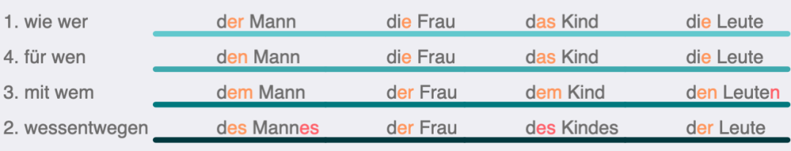

まず「三性四格」の変化を習得する必要があります。これは形容詞変化の基礎であり、ほぼすべてのドイツ語原版教材がA1レベルで段階的に導入する内容です：

内容は多く見えませんが、初心者には心理的ハードルが高く、名詞の性の規則も徐々に習得する必要があります。この表をマスターする最も重要なポイントは：冠詞だけを暗記するのではなく、前置詞構造ごと覚えることです。der, den...のように暗記するのは非効率的で、wie der Mann... wegen des Kindes...のように文脈で覚えるべきです。er/sie/esの表とこの表を組み合わせることも可能で、両者の語尾は一致しています。

三性四格の基礎を習得した後、教科書では形容詞変化の多数の例が登場します。伝統的には弱変化、強変化、混合変化（用語は重要ではありません）の3つの大きな表にまとめられます：

3つの表を観察すると、形容詞変化の語尾には3種類しかないことがわかります：-e（オレンジ線）を付けるか、-en（紫線）を付けるか、あるいは定冠詞の三性四格の語尾（青線）を付けるかです。形容詞の強変化表は定冠詞の表とほぼ一致していますが、赤線部分だけが異なります。

これらの語尾が現れる環境を観察すると：冠詞に語尾がある場合、冠詞が性・数・格を示す主要な役割を担い、形容詞は副次的な役割（-eまたは-enを付加）を担います。冠詞（meinなどの代名詞を含む）に語尾がない場合、形容詞が性・数・格を示す主要な役割を担い、語尾変化は基本的に定冠詞と一致します。これにより3つの表を2段階の判断プロセスに簡略化できます：

この図の色分けは、形容詞変化の3つの表の色と完全に対応しています。

**第一段階：「冠詞に語尾があるか」を判断**します。例：

- wie der nett_ Mann 冠詞に語尾あり（derの語尾はer）
- für nett_ Leute 冠詞なし（当然語尾もなし）
- wie eine nett_ Frau 冠詞に語尾あり（語尾はe）
- für ein nett_ Kind 冠詞に語尾なし

このうち「für nett_ Leute」は上の図に従い、「定冠詞がこの場合に持つべき語尾」を加えるべきです。つまり、この形容詞が定冠詞だった場合を想定し、最初の三性四格の表に基づくと「für die Leute」となるため、「für nette Leute」となります。

一方「für ein nett_ Kind」は定冠詞に置き換えると「für das Kind」となるため、「für ein nettes Kind」です。「das」の語尾は「-es」と計算されます。

**第二段階の判断「第一格単数の形かどうか」** 例えば：

- 「(wie) der nett_ Mann」は第一格単数の形で、「der Mann」が第一格であるため、形容詞に「-e」を加えます（図中のオレンジ丸部分）。
- 「(für) eine nett_ Frau」は第一格単数の形で、「eine Frau」が第一格の形（ここではfürで第四格を取りますが）であるため、形容詞に「-e」を加えます（オレンジ丸）。
- 「(für) keine nett_ Leute」は第一格単数の形ではなく、「Leute」が複数形であるため、形容詞に「-en」を加えます（紫丸）。
- 「(mit) einem nett_ Mann」は第一格単数の形ではなく、「einem Mann」が第三格であるため、形容詞に「-en」を加えます（紫丸）。

この二段階の判断には一つ欠点、あるいはバグがあります。それは赤線部分で、これは個別に暗記するのが最善です。「Anfang letzten Monats/Jahres」と「schweren Herzens」（重い心を抱いて）の二つの例を覚えれば、冠詞なしの第二格男性・中性の場合、形容詞が「-en」を取ることがわかります。このバグは「語尾あり」の定義を「冠詞または名詞に語尾がある場合」とすることで回避可能ですが、これでは複雑化し子供向けではありません。そのため、むしろバグとして残し、個別に覚える方が良いでしょう。

前バージョンを基に順序を調整し、表現を修正しました。このバージョンも依然として二段階の推論ですが、全ての例外とバグが排除されています。そして対称的な美しさがあります。

ここで「冠詞なしだが名詞に第二格語尾がある」とは、実際には「冠詞なしの男性/中性単数第二格」を指しています。

最後のタコのような図形は、語尾がこの5種類しかないことを示しています。実際、ドイツ語の三性四格の語尾はこの5パターンしかなく、前の丸で囲んだ語尾もこのタコ図の中に含まれています。

### 例外

* 「lauter」（純粋な、まったくの）は語尾変化しません